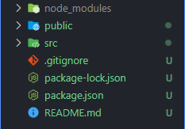
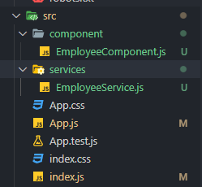
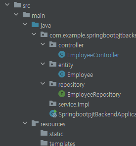

# React

**사용량 1위**

- Single Page Application 가능

- Component로 재사용 가능

- 데이터가 html에 자동 반영

Angular PWA react-native 등을 이용하면 앱으로 발행 가능

## Getting Start 

### 프로젝트 생성

폴더를 생성하고 `shift+우클릭` -> powershell 창 열기

```powershell
npx create-react-app (pjt이름)
```

pjt이름은 대문자 불가능



src > App.js 가 메인 페이지

### 프로젝트 실행

```
npm start
```

저장 시 자동으로 변경사항 적용됨

일반적으로 아래의 라이브러리를 이용하여 앱을 생성함

(https://create-react-app.dev/)

- modules
  - 프로젝트 구동에 필요한 모든 라이브러리
- public
  - static 파일 보관함
- src
  - source code 보관함
  - App.js
    - 여기에 쓰여있는 html 태그들을 public>index.html 에 적용된다.

다 지우고 아래와 같이 시작하면 된다.

```javascript
import logo from './logo.svg';
import './App.css';

function App() {
  return (
    <div className="App">

    </div>
  );
}
export default App;
```

- div의 클래스는 className으로 써야 Html class 로 인식
- 변수는 `{ 변수이름 }`를 활용하여 입력한다. id / className / src 모든 곳에 변수를 넣을 수 있음

**function App 안에는 하나의 div가 존재해야 한다.** (Vue와 동일)

#### state

변수를 임시적으로 저장하기 위함

```javascript
import { useState } from 'react';

let [a, b] = useState('남자 코트 추천')
// a와 b는 다른 이름으로 설정 가능

<h4>{ a }</h4>
// 남자 코트 추천
<h4>{ b }</h4>
// b는 해당 자료의 추가적인 가공을 할 때 사용 ex) b.length => 1
```

state를 쓰면 변수의 값이 변경되는 경우 HTML에 자동으로 바뀌어서 재렌더링됨

자주 변경되는 경우를 state로 선언하면 좋음

```react
import './App.css';
import { useState } from 'react';

function App() {

  let [글제목] = useState(['남자 코트 추천', '강남 우동맛집', '역삼 닭갈비 맛집'])
  let [좋아요, 좋아요변경] = useState(0);

  function like() {
    좋아요변경(좋아요+1);
  }
	// 좋아요의 샅태를 변화시킬때 부르는 이름 => 좋아요변경
  return (
    <div className="App">
      <div className="black-nav">
        <h4>블로그</h4> 
      </div>
      <div className='list'>
        <h4>{ 글제목[0] } <span onClick={ like }>💕</span> { 좋아요 } </h4>
        <p>2월 17일 발행</p>
      </div>
      <div className='list'>
        <h4>{ 글제목[1] }</h4>
        <p>2월 10일 발행</p>
      </div>
      <div className='list'>
        <h4>{ 글제목[2] }</h4>
        <p>2월 25일 발행</p>
      </div>
    </div>
  );
}

export default App;
```

만약 state의 변수가 array나 object면 카피를 한 다음에 바꿔줘야 state 값을 수정할 수 있음

### Component

반복적으로 하나의 틀을 써야할 때 / 큰 페이지 하나씩 / 자주 바뀌는 것들

component는 state를 변수로 적용하는 경우에는 사용하기 힘듦 / 불가능 하지는 않다.

1. function을 만들고
2. return() 안에 html 담기
3. `<함수명></함수명>` 으로 사용

```react
.....

      <Modal></Modal>
      <Modal/>
// 위의 두 가지 모두 가능한 문법
// 아래에서 정의된 Modal component를 사용

    </div>
  );
  function Modal() {
    return (
      <div className='modal'>
        <h4>제목</h4>
        <p>날짜</p>
        <p>상세내용</p>
      </div>
    );
  }
```

App() {} 밖에 함수 component를 작성해야 함

만약 component안에 여러 개의 div를 쓰고 싶다면 <> </> 묶어줄 수 있음 (react 문법)

- index.js

```javascript
import React from 'react';
import ReactDOM from 'react-dom/client';
import './index.css';
import App from './App';
import reportWebVitals from './reportWebVitals';

const root = ReactDOM.createRoot(document.getElementById('root'));
root.render(
  <React.StrictMode>
    <App />
  </React.StrictMode>
);

// If you want to start measuring performance in your app, pass a function
// to log results (for example: reportWebVitals(console.log))
// or send to an analytics endpoint. Learn more: https://bit.ly/CRA-vitals
reportWebVitals();
```

App template를 불러오고 `document.getElementById('root')`를 통해 index.html의 요소를 불러오게 됨

### props

- App.js

```react
function App() {
  return (
    <Wrapper>
      <Hello name="react" color="red" isSpecial={true}/>
      <Hello color="pink" />
    </Wrapper>
  )
}
```

​	`console.log(props)`를 해보면 `{name : 'react', color='red'}` 가 찍힌다. 아래에서 props라고 전체적으로 받아도 됨

- Hello.js

```react
import React from 'react';

function Hello({ color, name, isSpecial }) {
  return (
    <div style={{ color }}>
      { isSpecial ? <b>*</b> : null }
      안녕하세요 {name}
    </div>
  );
}

Hello.defaultProps = {
  name: '이름없음'
}

export default Hello;
```

삼항 연산자를 이용하면 조건부로 렌더링 가능

### input 상태

```react
import React, { useState } from 'react';

function InputSample() {
  const [text, setText] = useState('');

  const onChange = (e) => {
    setText(e.target.value);
  };

  const onReset = () => {
    setText('');
  };

  return (
    <div>
      <input onChange={onChange} value={text}  />
      <button onClick={onReset}>초기화</button>
      <div>
        <b>값: {text}</b>
      </div>
    </div>
  );
}

export default InputSample;
```


## Build

```shell
npm run build
```

위를 입력하면 배포를 위한 build를 시작함


## React 와 SpringBoot

### frontend(react)

아래는 react 디렉토리(VScode)



- EmployeeService.js

```javascript
import axios from 'axios'

const EMPLOYEES_REST_API_URL = 'http://localhost:8080/api/employees';

class EmployeeService{

  getEmployees(){
    return axios.get(EMPLOYEES_REST_API_URL);
  }

}

export default new EmployeeService();
```

axios 설치 후 통신으로 backend의 주소와 통신한다


- EmployeeComponent.js

```react

import React, { useEffect, useState } from 'react'
import EmployeeService from '../services/EmployeeService'

//rfc
// react function component
function EmployeeComponent() {

  const [employees, setEmployees] = useState([])

  useEffect(() => {
    getEmployees()
  }, [])

  const getEmployees = () => {
    EmployeeService.getEmployees().then((response) => {

      setEmployees(response.data);
      console.log(response.data);
    });
  }
  return (
    <div className='container'>
      <h1 className='text-center'> Employees List </h1>
      <table className='table table-striped'>
        <thead>
          <tr>
            <th> Employee Id </th>
            <th> First Name </th>
            <th> Last Name </th>
            <th> Email </th>
          </tr>
        </thead>
        <tbody>
          {
      // 아래는 js 문법 map
            employees.map(
              employee =>
              <tr key = {employee.id}>
                <td> {employee.id} </td>
                <td> {employee.firstName} </td>
                <td> {employee.lastName} </td>
                <td> {employee.email} </td>
              </tr>
            )
          }
        </tbody>
      </table>

    </div>
  )
}

export default EmployeeComponent
```

react function component 로 작성 (App.js와 같은 component)

#### useEffect

`useEffect( () => {params1} , [params2])`

Hook / 컴포넌트가 마운트 됐을 때(처음 나타날 때 / 사라질 때 / 특정 props가 바뀔 때) 특정 작업을 처리하는 방법

params2 가 비어있다면 컴포넌트가 처음 나타날때(렌더링)에만 userEffect의 이벤트 params1가 호출

cleanup 함수는 컴포넌트가 사라질 때 호출됨

- 마운트 시에 하는 작업들
  - props 로 받은 값을 컴포넌트의 로컬 상태로 설정
  - 외부 API 요청
  - 라이브러리 사용
  - sefinterval을 통한 반복잡업 혹은 setTimeout을 통한 작업 예약
  - 


- App.js

```javascript
import './App.css';
import EmployeeComponent from './component/EmployeeComponent';

function App() {
  return (
    <EmployeeComponent/>
      // 템플릿 상태로 들어감
  );
}

export default App;
```


### backend(springboot)



```java
package com.example.springbootpjtbackend.controller;


import com.example.springbootpjtbackend.entity.Employee;
import com.example.springbootpjtbackend.repository.EmployeeRepository;
import org.springframework.beans.factory.annotation.Autowired;
import org.springframework.web.bind.annotation.CrossOrigin;
import org.springframework.web.bind.annotation.GetMapping;
import org.springframework.web.bind.annotation.RequestMapping;
import org.springframework.web.bind.annotation.RestController;

import java.util.List;

@RestController
@RequestMapping("/api")
@CrossOrigin("http://localhost:3000/")
// frontend 주소
public class EmployeeController {

    @Autowired
    private EmployeeRepository employeeRepository;

    @GetMapping(value = "/employees")
    private List<Employee> fetchEmployee() {
        return employeeRepository.findAll();
    }


}
```

#### @CrossOrigin

웹페이지의 제한된 자원을 외부 도메인에서 접근을 허용해주는 매커니즘

서로 다른 도메인에서 리소스를 공유하는 방식

CORS를 스프링을 통해 설정할 수 있는 어노테이션 기능 / 복수인 경우 콤마(,)로 구분


### Bootstrap

`import 'bootstrap/dist/css/bootstrap.min.css';`

`npm install bootstrap`을 한 뒤 위의 코드를 index.js에 추가해줌


## SPA (React-router)

SPA를 만들기 위함

```shell
yarn add react-router-dom
npm add react-router-dom
```

라우터 적용은 index.js에서 BrowserRouter 라는 컴포넌트를 사용하여 구현

- index.js

```react
const root = ReactDOM.createRoot(document.getElementById('root'));
root.render(
//  <React.StrictMode>
    <BrowserRouter>
    <App />
    </BrowserRouter>
//  </React.StrictMode>
);
```

위 처럼 App을 BrowserRouter로 감싸준다.

렌더링 할 페이지를 js로 만든다.

```react
<Route path="{주소 규칙}" component={'보여줄 컴포넌트 이름'}/>
```

위처럼 Route를 이용하면 주소규칙에 따라 컴포넌트를 불러온다.

만약 하위 주소와 상위 주소의 일부가 같으면 둘다 불러오는 문제가 있음

이는 아래처럼 `exact={true}`를 통해 props를 설정하면 정확히 그 주소일 때만 나온다.

```react
import React from 'react';
import { Route } from 'react-router-dom';
import About from './About';
import Home from './Home';

const App = () => {
  return (
    <div>
      <Route path="/" exact={true} component={Home} />
      <Route path="/about" component={About} />
    </div>
  );
};
```

만약 `	  <Route path="/"component={Home} />` 처럼 작성하면 /about 페이지를 들어갔을 때 home과 about 두 컴포넌트 모두 불러옴

a 태그를 사용하면 페이지를 새로 불러오기 때문에 현재 페이지 렌더링상태가 초기화 된다. 따라서 이 경우 Link를 사용하면 됨

```react
import React from 'react';
import { Route, Link } from 'react-router-dom';
import About from './About';
import Home from './Home';

const App = () => {
  return (
    <div>
      <ul>
        <li>
          <Link to="/">홈</Link>
        </li>
        <li>
          <Link to="/about">소개</Link>
        </li>
      </ul>
      <hr />
      <Route path="/" exact={true} component={Home} />
      <Route path="/about" component={About} />
    </div>
  );
};

export default App;
```

렌더링 하여 주소만 바꿀 뿐 페이지를 새로 불러오는 것은 아니다.


# React CRUD PJT

## React + SpringBoot

### Front-End (React)

`npm install react-router-dom@5`

라우터 v5를 설치

- route v5
  - Switch를 사용
    - 아래에서 처럼 Route안의 component로 컴포넌트 이름을 작성
  - this.props.history.push('{주소}')
    - 다음 주소로 이동 가능
- route v6+
  - Routes사용
    - Route안의 element안에 컴포넌트 이름을 작성
  - this.props.history.push() 사용 불가 / useNavitage 를 대신 사용
    - useNavigate().setState() 를 사용 / 이후 문서 확인 必

여기서 rcc를 이용해 작성했지만, rfc로 작성이 권장됨

App.js에 Routes/Switch로 전환할 컴포넌트들을 조건에 따라 기재

해당 컴포넌트를 작성

필요한 Service를 작성 (axios같은 API 통신을 포함)

- App.js

```react
import './App.css';
import ListEmployeeComponent from './components/ListEmployeeComponent';
import HeaderComponent from './components/HeaderComponent';
import FooterComponent from './components/FooterComponent';
import {BrowserRouter as Router, Route, Switch} from 'react-router-dom'
import CreaeteEmployeeComponent from './components/CreaeteEmployeeComponent';
function App() {
  return (
    <div>
      <Router>
        <HeaderComponent/>
        <div className='container'>
          {/*  react-router-dom v6 부터는 Switch대신 Routes를 사용 */}
          {/*  component 대신에 element 사용 */}
          <Switch>
            <Route path = "/" exact={true} component = {ListEmployeeComponent}></Route>
            <Route path = "/employees" component = {ListEmployeeComponent}></Route>
            <Route path = "/add-employee" component = {CreaeteEmployeeComponent}></Route>
          </Switch>
        </div>
        <FooterComponent/>
      </Router>
    </div>
    
  );
}
export default App;
```

- EmployeeService

```javascript
import axios from 'axios';

const EMPLOYEE_API_BASE_URL = "http://localhost:8080/api/v1/employees";

class EmployeeService {

  getEmployees() {
    return axios.get(EMPLOYEE_API_BASE_URL);
  }

  createEmployee(employee) {
    return axios.post(EMPLOYEE_API_BASE_URL, employee);
  }
}
export default new EmployeeService()
```

axios 통신 service를 기재


### Back-End (SpringBoot)

