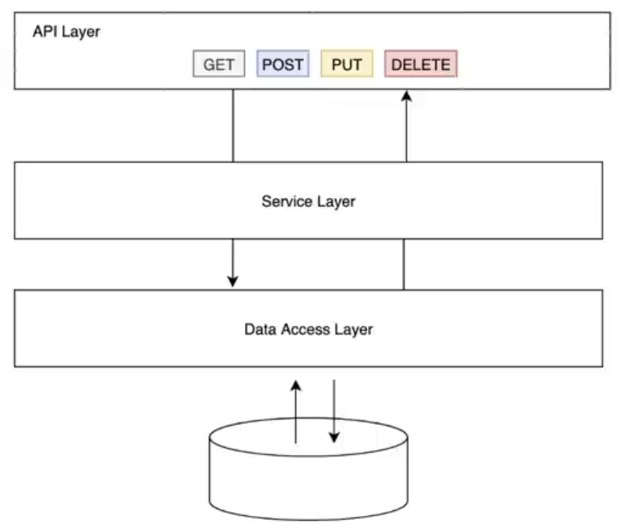
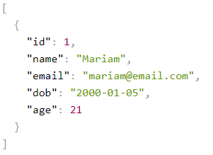
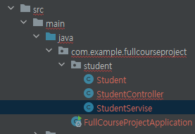
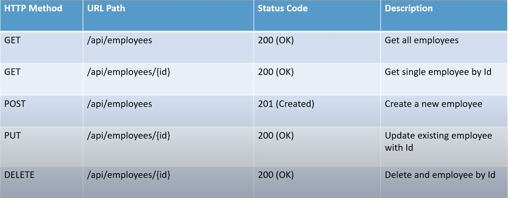
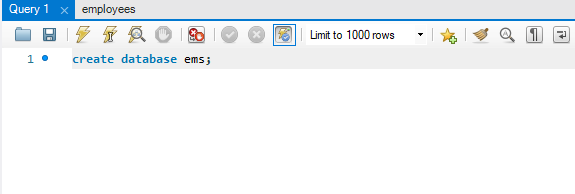
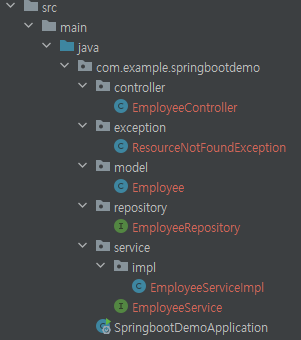
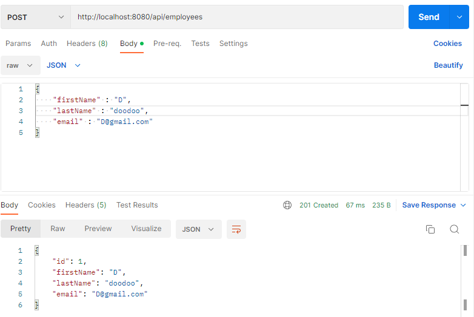
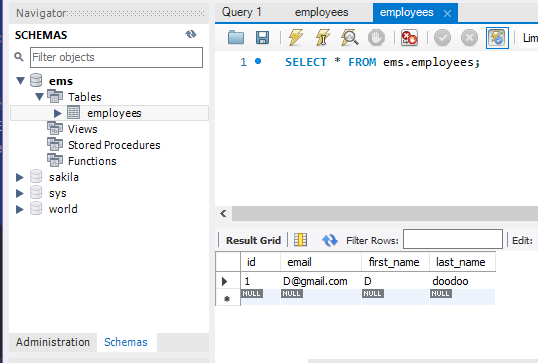
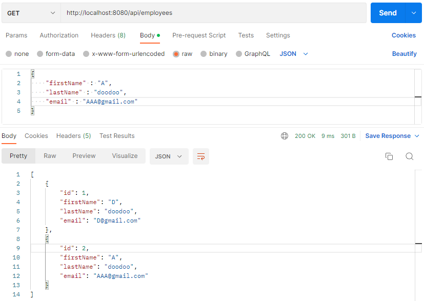

# Spring Boot Full Course


만약 메서드의 return 타입을 List로 하면 JSON 형태로 return 해준다

```java
@RequestMapping(value = "/hello")
public List hello() {
    return List.of("Hello World");
}
```





## API Layer

```java
package com.example.fullcourseproject.student;

import lombok.Getter;
import lombok.Setter;
import lombok.ToString;

import java.time.LocalDate;

@Getter
@Setter
@ToString

public class Student {
    private Long id;
    private String name;
    private String email;
    private LocalDate dob;
    private int age;

    public Student() {
    }

    public Student(Long id, String name, String email, LocalDate dob, int age) {
        this.id = id;
        this.name = name;
        this.email = email;
        this.dob = dob;
        this.age = age;
    }

    public Student(String name, String email, LocalDate dob, int age) {
        this.name = name;
        this.email = email;
        this.dob = dob;
        this.age = age;
    }
}
```

```java
@RequestMapping(value = "/hello")
public List<Student> hello() {
    return List.of(
        new Student(
            1L,
            "Mariam",
            "mariam@email.com",
            LocalDate.of(2000, Month.JANUARY, 5),
            21
        )
    );
}
```

위와 같이 작성하면 아래 처럼 JSON으로 출력됨




## Business Layer



위처럼 파일 구성 이후

- StudentService.java

```java
package com.example.fullcourseproject.student;

import org.springframework.stereotype.Service;
import org.springframework.web.bind.annotation.RequestMapping;

import java.time.LocalDate;
import java.time.Month;
import java.util.List;

@Service
public class StudentService {
    @RequestMapping
    public List<Student> getStudents() {
        return List.of(
                new Student(
                        1L,
                        "Mariam",
                        "mariam@email.com",
                        LocalDate.of(2000, Month.JANUARY, 5),
                        21
                )
        );
    }
}
```

### @Service

해당 클래스를 루트 컨테이너에 빈(Bean) 객체로 생성해주는 어노테이션 (@Component 도 사용하지만 가시성이 떨어져 사용하지 않음)

이 내부에서 자바 로직을 처리함 / 비즈니스 로직에는 해당 어노테이션을 사용하는 것을 권장

- StudentController.java

```java
package com.example.fullcourseproject.student;

import org.springframework.beans.factory.annotation.Autowired;
import org.springframework.web.bind.annotation.RequestMapping;
import org.springframework.web.bind.annotation.RestController;

import java.util.List;

@RestController
@RequestMapping(path = "api/v1/student")
public class StudentController {

    private final StudentService studentService;

    @Autowired
    public StudentController(StudentService studentService) {
        this.studentService = studentService;
    }

    @RequestMapping
    public List<Student> getStudents() {
        return studentService.getStudents();
    }
}
```

### @Autowired

필요한 의존 객체의 타입에 해당하는 빈(Bean)을 찾아 주입한다. (생성자, setter, 필드)

DI(Dependenct Injection) 의존성 종속 - 클래스간의 의존 관계를 스프링 컨테이너가 자동으로 연결

Autowired를 설정한 메서드가 자동으로 호출되고, 인스턴스가 자동으로 주입됨

### @Qualifier

Autowired로 연결한 빈 목록에서 유일한 빈을 구별함 (예 @Qualifier(value = "빈이름") )

연결할 빈의 값 타입을 지정 (예 @Qualifier("serviceName") )





### My SQL

#### DB TABLE 생성



- application.properties

```java
spring.datasource.url=jdbc:mysql://localhost:3306/ems?useSSL=false
spring.datasource.username=root
spring.datasource.password=1234

##Hibernate properties
#spring.jpa.properties.hibernate.dialect=org.hibernate.dialect.MySQL5InnoDBDialect
#create create-drop
spring.jpa.hibernate.ddl-auto=update

```

- pom.xml

```xml
<dependency>
    <groupId>org.springframework.boot</groupId>
    <artifactId>spring-boot-starter-data-jpa</artifactId>
</dependency>
<dependency>
    <groupId>mysql</groupId>
    <artifactId>mysql-connector-java</artifactId>
    <scope>runtime</scope>
</dependency>
<dependency>
    <groupId>org.springframework.boot</groupId>
    <artifactId>spring-boot-starter-data-jdbc</artifactId>
</dependency>
```

mysql과 data-jpa, data-jdbc를 추가해준다.


## Employee REST API



### CreateEmployee API

- EmployeeService.java

```java
package com.example.springbootdemo.service;

import com.example.springbootdemo.model.Employee;

public interface EmployeeService {
    Employee saveEmployee(Employee employee);
}
```

- EmployeeServiceImpl.java

```java
package com.example.springbootdemo.service.impl;

import com.example.springbootdemo.model.Employee;
import com.example.springbootdemo.repository.EmployeeRepository;
import com.example.springbootdemo.service.EmployeeService;
import org.springframework.stereotype.Service;

@Service
public class EmployeeServiceImpl implements EmployeeService {

    private EmployeeRepository employeeRepository;

    public EmployeeServiceImpl(EmployeeRepository employeeRepository) {
        super();
        this.employeeRepository = employeeRepository;
    }

    @Override
    public Employee saveEmployee(Employee employee) {
        return employeeRepository.save(employee);
    }

}
```

- EmployeeRepository.java

```java
package com.example.springbootdemo.repository;

import com.example.springbootdemo.model.Employee;
import org.springframework.data.jpa.repository.JpaRepository;

public interface EmployeeRepository extends JpaRepository<Employee, Long> {

}
```

- EmployeeController.java

```java
package com.example.springbootdemo.controller;

import com.example.springbootdemo.model.Employee;
import com.example.springbootdemo.service.EmployeeService;
import org.springframework.http.HttpStatus;
import org.springframework.http.ResponseEntity;
import org.springframework.web.bind.annotation.PostMapping;
import org.springframework.web.bind.annotation.RequestBody;
import org.springframework.web.bind.annotation.RequestMapping;
import org.springframework.web.bind.annotation.RestController;

@RestController
@RequestMapping(path = "/api/employees")
public class EmployeeController {
    private EmployeeService employeeService;

    public EmployeeController(EmployeeService employeeService) {
        super();
        this.employeeService = employeeService;
    }

    @PostMapping(value = "")
    public ResponseEntity<Employee> saveEmployee(@RequestBody Employee employee) {
        return new ResponseEntity<Employee>(employeeService.saveEmployee(employee), HttpStatus.CREATED);

    }
}
```





workbench 확인해 보면 데이터가 들어가 있음

### GetAllEmployee API



- EmployeeService.java

```java
// 추가
List<Employee> getAllEmployees();
```

- EmployeeServiceImpl.java

```java
// 추가
@Override
public List<Employee> getAllEmployees() {
    return employeeRepository.findAll();
}
```

- EmployeeController.java

```java
// 추가
//build get all employees REST API
@GetMapping(value = "")
public List<Employee> getAllEmployees() {
    return employeeService.getAllEmployees();
}
```

