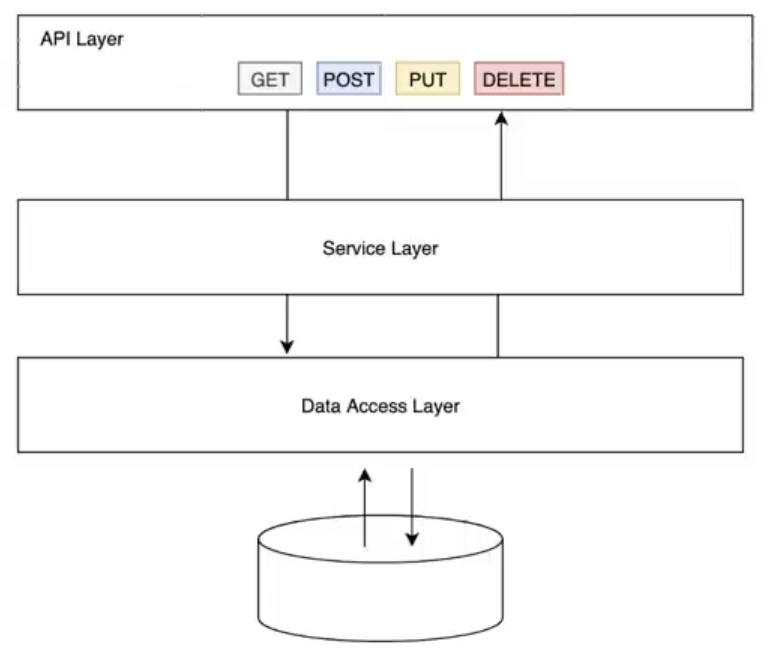
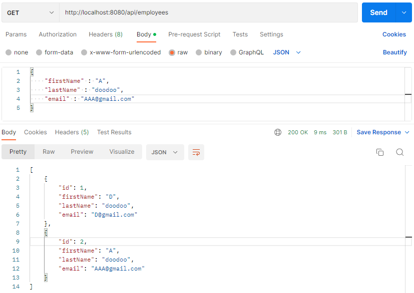

# Spring Boot Full Course


**Service 작성 이후 ServiceImpl를 작성하고 사용할 주소와 동작을 하는 controller 작성**

**만약 controller에서 return 하려는 것이 객체라면 return 값에 ResponseEntity<>를 사용한다.**


만약 메서드의 return 타입을 List로 하면 JSON 형태로 return 해준다

```java
@RequestMapping(value = "/hello")
public List hello() {
    return List.of("Hello World");
}
```





## API Layer

```java
package com.example.fullcourseproject.student;

import lombok.Getter;
import lombok.Setter;
import lombok.ToString;

import java.time.LocalDate;

@Getter
@Setter
@ToString

public class Student {
    private Long id;
    private String name;
    private String email;
    private LocalDate dob;
    private int age;

    public Student() {
    }

    public Student(Long id, String name, String email, LocalDate dob, int age) {
        this.id = id;
        this.name = name;
        this.email = email;
        this.dob = dob;
        this.age = age;
    }

    public Student(String name, String email, LocalDate dob, int age) {
        this.name = name;
        this.email = email;
        this.dob = dob;
        this.age = age;
    }
}
```

```java
@RequestMapping(value = "/hello")
public List<Student> hello() {
    return List.of(
        new Student(
            1L,
            "Mariam",
            "mariam@email.com",
            LocalDate.of(2000, Month.JANUARY, 5),
            21
        )
    );
}
```

위와 같이 작성하면 아래 처럼 JSON으로 출력됨


## Business Layer


위처럼 파일 구성 이후

- StudentService.java

```java
package com.example.fullcourseproject.student;

import org.springframework.stereotype.Service;
import org.springframework.web.bind.annotation.RequestMapping;

import java.time.LocalDate;
import java.time.Month;
import java.util.List;

@Service
public class StudentService {
    @RequestMapping
    public List<Student> getStudents() {
        return List.of(
                new Student(
                        1L,
                        "Mariam",
                        "mariam@email.com",
                        LocalDate.of(2000, Month.JANUARY, 5),
                        21
                )
        );
    }
}
```

### @Service

해당 클래스를 루트 컨테이너에 빈(Bean) 객체로 생성해주는 어노테이션 (@Component 도 사용하지만 가시성이 떨어져 사용하지 않음)

이 내부에서 자바 로직을 처리함 / 비즈니스 로직에는 해당 어노테이션을 사용하는 것을 권장

- StudentController.java

```java
package com.example.fullcourseproject.student;

import org.springframework.beans.factory.annotation.Autowired;
import org.springframework.web.bind.annotation.RequestMapping;
import org.springframework.web.bind.annotation.RestController;

import java.util.List;

@RestController
@RequestMapping(path = "api/v1/student")
public class StudentController {

    private final StudentService studentService;

    @Autowired
    public StudentController(StudentService studentService) {
        this.studentService = studentService;
    }

    @RequestMapping
    public List<Student> getStudents() {
        return studentService.getStudents();
    }
}
```

### @Autowired

필요한 의존 객체의 타입에 해당하는 빈(Bean)을 찾아 주입한다. (생성자, setter, 필드)

DI(Dependenct Injection) 의존성 종속 - 클래스간의 의존 관계를 스프링 컨테이너가 자동으로 연결

Autowired를 설정한 메서드가 자동으로 호출되고, 인스턴스가 자동으로 주입됨

### @Qualifier

Autowired로 연결한 빈 목록에서 유일한 빈을 구별함 (예 @Qualifier(value = "빈이름") )

연결할 빈의 값 타입을 지정 (예 @Qualifier("serviceName") )


### My SQL

#### DB TABLE 생성


- application.properties

```java
spring.datasource.url=jdbc:mysql://localhost:3306/ems?useSSL=false
spring.datasource.username=root
spring.datasource.password=1234

##Hibernate properties
#spring.jpa.properties.hibernate.dialect=org.hibernate.dialect.MySQL5InnoDBDialect
#create create-drop
spring.jpa.hibernate.ddl-auto=update

```

- pom.xml

```xml
<dependency>
    <groupId>org.springframework.boot</groupId>
    <artifactId>spring-boot-starter-data-jpa</artifactId>
</dependency>
<dependency>
    <groupId>mysql</groupId>
    <artifactId>mysql-connector-java</artifactId>
    <scope>runtime</scope>
</dependency>
<dependency>
    <groupId>org.springframework.boot</groupId>
    <artifactId>spring-boot-starter-data-jdbc</artifactId>
</dependency>
```

mysql과 data-jpa, data-jdbc를 추가해준다.


## Employee REST API


### CreateEmployee API

- EmployeeService.java

```java
package com.example.springbootdemo.service;

import com.example.springbootdemo.model.Employee;

public interface EmployeeService {
    Employee saveEmployee(Employee employee);
}
```

- EmployeeServiceImpl.java

```java
package com.example.springbootdemo.service.impl;

import com.example.springbootdemo.model.Employee;
import com.example.springbootdemo.repository.EmployeeRepository;
import com.example.springbootdemo.service.EmployeeService;
import org.springframework.stereotype.Service;

@Service
public class EmployeeServiceImpl implements EmployeeService {

    private EmployeeRepository employeeRepository;

    public EmployeeServiceImpl(EmployeeRepository employeeRepository) {
        super();
        this.employeeRepository = employeeRepository;
    }

    @Override
    public Employee saveEmployee(Employee employee) {
        return employeeRepository.save(employee);
    }

}
```

- EmployeeRepository.java

```java
package com.example.springbootdemo.repository;

import com.example.springbootdemo.model.Employee;
import org.springframework.data.jpa.repository.JpaRepository;

public interface EmployeeRepository extends JpaRepository<Employee, Long> {

}
```

- ResourceNotFoundException.java

```java
package com.example.springbootdemo.exception;

import lombok.Getter;
import lombok.Setter;
import lombok.ToString;
import org.springframework.http.HttpStatus;
import org.springframework.web.bind.annotation.ResponseStatus;

@Getter
@Setter
@ToString
@ResponseStatus(value = HttpStatus.NOT_FOUND)

public class ResourceNotFoundException extends RuntimeException{
    private String resourceName;
    private String fieldName;
    private Object fieldValue;

    public ResourceNotFoundException(String resourceName, String fieldName, Object fieldValue) {
        super(String.format("%s not found with %s : '%s'", resourceName, fieldName, fieldValue));
        this.resourceName = resourceName;
        this.fieldName = fieldName;
        this.fieldValue = fieldValue;
    }
}
```

위의 코드를 작성하면 404 not found의 요청을 해결할 수 있음


- EmployeeController.java

```java
package com.example.springbootdemo.controller;

import com.example.springbootdemo.model.Employee;
import com.example.springbootdemo.service.EmployeeService;
import org.springframework.http.HttpStatus;
import org.springframework.http.ResponseEntity;
import org.springframework.web.bind.annotation.PostMapping;
import org.springframework.web.bind.annotation.RequestBody;
import org.springframework.web.bind.annotation.RequestMapping;
import org.springframework.web.bind.annotation.RestController;

@RestController
@RequestMapping(path = "/api/employees")
public class EmployeeController {
    private EmployeeService employeeService;

    public EmployeeController(EmployeeService employeeService) {
        super();
        this.employeeService = employeeService;
    }

    @PostMapping(value = "")
    public ResponseEntity<Employee> saveEmployee(@RequestBody Employee employee) {
        return new ResponseEntity<Employee>(employeeService.saveEmployee(employee), HttpStatus.CREATED);

    }
}
```


workbench 확인해 보면 데이터가 들어가 있음

### GetAllEmployee API



- EmployeeService.java

```java
// 추가
List<Employee> getAllEmployees();
```

- EmployeeServiceImpl.java

```java
// 추가
@Override
public List<Employee> getAllEmployees() {
    return employeeRepository.findAll();
}
```

- EmployeeController.java

```java
// 추가
//build get all employees REST API
@GetMapping(value = "")
public List<Employee> getAllEmployees() {
    return employeeService.getAllEmployees();
}
```


### GetById API

repository 에서 findbyid를 사용하여 찾는다. getbyid는 더 이상 사용하지 않는 메서드!!

- EmployeeService.java

```java
Employee getEmployeeById(long id);
```

- EmployeeServiceImpl.java

```java
    @Override
    public Employee getEmployeeById(long id) {
//        Optional<Employee> employee = employeeRepository.findById(id);
//        if (employee.isPresent())
//            return employee.get();
//        else
//            throw new ResourceNotFoundException("Employee", "Id", id);
        
//        위와 아래는 같은 코드
        return employeeRepository.findById(id).orElseThrow(() ->
                new ResourceNotFoundException("Employee", "id", id));
    }
```

아래 처럼 작성하면 훨씬 짧게 작성이 가능

orElseThrow를 통해 해당 객체가 없는 경우 에러를 띄워준다. 위에서 작성한 notFoundException을 통해

- EmployeeController.java

```java
    @GetMapping(value = "{id}")
    public ResponseEntity<Employee> getEmployeeById(@PathVariable("id") long employeeId) {
        return new ResponseEntity<Employee>(employeeService.getEmployeeById(employeeId), HttpStatus.OK);
    }
```


### UpdateEmployee  API

- EmployeeService.java

```java
    Employee updateEmployee(Employee employee, long id);
```

- EmployeeServiceImpl.java

```java
    @Override
    public Employee updateEmployee(Employee employee, long id) {
        // 해당 id의 employee가 DB에 존재하지 않는다면 404 throw
        Employee existingEmployee = employeeRepository.findById(id).orElseThrow(() ->
                new ResourceNotFoundException("Employee", "id", id));
        // 존재하는 경우 해당 값을 employee로 update
        existingEmployee.setFirstName(employee.getFirstName());
        existingEmployee.setLastName(employee.getLastName());
        existingEmployee.setEmail(employee.getEmail());
        // update한 값을 저장
        employeeRepository.save(existingEmployee);
        return existingEmployee;
    }
```

- EmployeeController.java

```java
    @PutMapping(value = "{id}")
    public ResponseEntity<Employee> updateEmployee(@PathVariable("id") long id,
                                                   @RequestBody Employee employee) {
        return new ResponseEntity<Employee>(employeeService.updateEmployee(employee, id), HttpStatus.OK);
    }
// RequestBody에서 employee를 가져온다
```

### DeleteEmployee API

- EmployeeService.java

```java
    void deleteEmployee(long id);
```

- EmployeeServiceImpl.java

```java
    @Override
    public void deleteEmployee(long id) {
        employeeRepository.findById(id).orElseThrow(() ->
                new ResourceNotFoundException("employee", "id", id));
        employeeRepository.deleteById(id);
    }
```

- EmployeeController.java

```java
    @DeleteMapping(value = "{id}")
    public ResponseEntity<String> deleteEmployee(@PathVariable("id") long id) {
        employeeService.deleteEmployee(id);
        return new ResponseEntity<String>("Employee deleted successfully!!", HttpStatus.OK);
    }
```


# Thymeleaf

## What is Thymeleaf

동적으로 화면을 구성하여 사용할 수 있게 함

HTML, XML, css, JS 등을 사용하기 위한 template


초반 dependency 설정에서 추가할 수 있고, 중간에 아래의 코드를 추가하면 사용 가능

controller.java 에서 @RestController를 쓰면 thymeleaf를 사용하지 못한다.

@Controller를 사용해야함

- pom.xml

```xml
<dependency>
    <groupId>org.springframework.boot</groupId>
    <artifactId>spring-boot-starter-thymeleaf</artifactId>
</dependency>
```

아래와 같은 파일 구조를 가짐


### 변수

- helloworldController.js

```java
    @GetMapping(value = "/hello")
    public String hello(Model model) {
        model.addAttribute("message", "Hello World");
        return "helloworld";
    }
```

- helloworld.html

```html
<!DOCTYPE html>
<html xmlns:th="https://www.thymeleaf.org">
<head>
    <meta charset="UTF-8">
    <title>Thymeleaf HelloWorld App</title>
</head>
<body>
  <h1 th:text = "'Thymeleaf ' + ${message} + ' App'"></h1>

</body>
</html>
```

<html lang="ko" xmlns:th="http://www.thymeleaf.org"> 타임리프를 사용하겠다고 선언

model.addAttribute로 message이름으로 "Hello World"를 담아서 html에서 사용 가능


### css / js

- helloworldController.js

```java
    @GetMapping(value = "/style")
    public String style() {
        return "add-css-js-demo";
    }
```

return 해주는 값은 templates의 이름인 add-css-js-demo로 해주어야 views가 뜬다.

이름이 다르면 에러 발생

- add-css-js-demo/html

```html
<!DOCTYPE html>
<html>
<head>
  <meta charset="UTF-8">
  <title>Add CSS and JS to Thymeleaf</title>
  <!-- link를 통해 css 파일 추가 -->
  <link th:href = "@{/css/main.css}" rel="stylesheet">
  <!--  script를 통해 js 파일 추가-->
  <script type="text/javascript" th:src="@{/js/action.js}"></script>
</head>
<body>
  <h2>Heading</h2>
  <p>
    This is text on which we want to apply <strong>very special</strong> styling.
  </p>
  <button type="button" th:onclick="demo()">Show Alert</button>

</body>
</html>
```

위의 파일 경로 대로 js와 css를 작성하고 경로를 통해 추가하면 된다.

@를 쓰면 static 경로를 의미함(maybe)


if else switch 모두 사용 가능


# SpringBoot CRUD PJT


- dependencies
  - lombok
  - spring-web
  - sql db
  - data-jpa
  - thymeleaf
  - devtools

- application.properties

```properties
spring.datasource.url = jdbc:mysql://localhost:3306/sms?useSSL=false
spring.datasource.username = root
spring.datasource.password = 1234

#spring.jpa.properties.hibernate.dialect = org.hibernate.dialect.MySQL5InnoDBDialect
#logging.level.org.hibernate.SQL = DE
# 위의 두 코드는 입력시 오류 발생

spring.jpa.hibernate.ddl-auto=update
spring.devtools.livereload.enabled=true

```

보통 작성 순서

Entity와 Repository에서 객체를 정의함 . DB테이블을 생성하고 연결

controller에 주소와 변수를 설정하고 service에서 선언하고 serviceImpl에서 이를 정의하고 다시 Controller에서 작성하고 View와 연결


- Entity.java

```java
package com.example.thymeleafspringbootdemo.entity;


import jakarta.persistence.*;
import lombok.AllArgsConstructor;
import lombok.Getter;
import lombok.Setter;

@Getter
@Setter
@AllArgsConstructor
@Entity
@Table(name = "Students")
public class Student {
    @Id
    @GeneratedValue(strategy = GenerationType.IDENTITY)
    private Long id;
    @Column(name = "first_name")
    private String firstName;
    @Column(name = "last_name")
    private String lastName;
    @Column(name = "email")
    private String email;

    public Student() {
    }
    public Student(String firstName, String lastName, String email) {
        this.firstName = firstName;
        this.lastName = lastName;
        this.email = email;
    }
}
```

DB 테이블로 생성하기 위해서 Table과 Entity 그리고 Id와 Column을 설정함

- StudentRepository.java

```java
package com.example.thymeleafspringbootdemo.repository;

import com.example.thymeleafspringbootdemo.entity.Student;
import org.springframework.data.jpa.repository.JpaRepository;

// @Repository
// SimpleJpaRepository
public interface StudentRepository extends JpaRepository<Student, Long> {

}
```

jparepository는 인터페이스 / `JpaRepository<엔티티, ID 유형>`을 상속받아서 작성

- StudentController.java

```java
package com.example.thymeleafspringbootdemo.controller;

import com.example.thymeleafspringbootdemo.entity.Student;
import com.example.thymeleafspringbootdemo.service.StudentService;
import org.springframework.stereotype.Controller;
import org.springframework.ui.Model;
import org.springframework.web.bind.annotation.*;

@Controller
public class StudentController {

    private StudentService studentService;

    public StudentController(StudentService studentService) {
        super();
        this.studentService = studentService;
    }
    // studnet 리스트를 보여주는 view 연결
    @GetMapping(value = "/students")
    public String listStudents(Model model) {
        model.addAttribute("students", studentService.getAllStudents());
        return "students";
    }
	// createForm을 반환 view와 연결
    @GetMapping(value = "/students/new")
    public String createStudentForm(Model model) {
        Student student = new Student();
        model.addAttribute("student", student);
        return "create_student";
    }
	// createForm에서 post방식으로 '/students'로 요청하는 경우 save 한다.
    @PostMapping(value = "/students")
    public String saveStudent(@ModelAttribute("student") Student student) {
        studentService.saveStudent(student);
        return "redirect:/students";
        // redirect로 다른 view로 이동 가능
    }

    // updateForm을 반환 View와 연결
    @GetMapping(value = "/students/edit/{id}")
    public String editStudentForm(@PathVariable long id, Model model) {
        model.addAttribute("student", studentService.getStudentById(id));
        return "edit_student";
    }
	// createForm에서 post방식으로 '/students/{id}'로 요청하는 경우 update 한다.
    @PostMapping(value = "/students/{id}")
    public String updateStudent(@PathVariable Long id,
                                @ModelAttribute("student") Student student,
                                Model model) {
        Student existingStudent = studentService.getStudentById(id);
        // Id로 student 탐색
        existingStudent.setFirstName(student.getFirstName());
        existingStudent.setLastName(student.getLastName());
        existingStudent.setEmail(student.getEmail());
        // 해당 student를 받은 객체 student의 값으로 바꿈
        studentService.editStudent(existingStudent);
        // 이를 저장
        return "redirect:/students";
    }
	// get 방식으로 '/students/{id}'를 요청하면 해당 student delete
    @GetMapping(value = "/students/{id}")
    public String deleteStudent(@PathVariable Long id) {
        studentService.deleteStudentById(id);
        return "redirect:/students";
    }
}
```

- StudentService.java

```java
package com.example.thymeleafspringbootdemo.service;
import com.example.thymeleafspringbootdemo.entity.Student;
import java.util.List;

public interface StudentService {
    List<Student> getAllStudents();
    Student saveStudent(Student student);
    Student getStudentById(Long id);
    Student editStudent(Student student);
    void deleteStudentById(Long id);
    // 설계도 밑바탕
}
```

### interface

일종의 추상 클래스

구현된 것은 없고 그냥 밑바탕의 빈 설계도 느낌 / 메서드의 경우 `public abstract`가 자동으로 추가됨


- StudentServiceImpl.java

```java
package com.example.thymeleafspringbootdemo.service.impl;

import com.example.thymeleafspringbootdemo.entity.Student;
import com.example.thymeleafspringbootdemo.repository.StudentRepository;
import com.example.thymeleafspringbootdemo.service.StudentService;
import org.springframework.stereotype.Service;
import java.util.List;

@Service
// service 구현
// service로 부터 설계도를 상속 받아 이를 구현함(implements)
public class StudentServiceImpl implements StudentService {

    private StudentRepository studentRepository;

    public StudentServiceImpl(StudentRepository studentRepository) {
        super();
        this.studentRepository = studentRepository;
    }

    @Override
    public List<Student> getAllStudents() {
        return studentRepository.findAll();
    }

    @Override
    public Student saveStudent(Student student) {
        return studentRepository.save(student);
    }

    @Override
    public Student getStudentById(Long id) {
        return studentRepository.findById(id).get();
    }

    @Override
    public Student editStudent(Student student) {
        return studentRepository.save(student);
    }

    @Override
    public void deleteStudentById(Long id) {
        studentRepository.deleteById(id);
    }
}

```

- students.html

```html
<!DOCTYPE html>
<html lang="en" xmlns:th="http://www.thymeleaf.org">
<head>
    <meta charset="UTF-8">
    <title>Student Management System</title>
    <link href="https://cdn.jsdelivr.net/npm/bootstrap@5.3.0-alpha1/dist/css/bootstrap.min.css"
          rel="stylesheet"
          integrity="sha384-GLhlTQ8iRABdZLl6O3oVMWSktQOp6b7In1Zl3/Jr59b6EGGoI1aFkw7cmDA6j6gD"
          crossorigin="anonymous">
</head>
<body>

<!-- navbar -->
    <nav class="navbar navbar-expand-md bg-dark navbar-dark">
        <a class="navbar-brand mx-3"> Student Management System</a>

        <button class="navbar-toggler" type="button" data-toggle="collapse" data-target="#collapsibleNavbar">
            <span class="navbar-toggler-icon"></span>
        </button>

        <div class="collapse navbar-collapse" id="collapsibleNavbar">
            <ul class="navbar-nav">
                <li class="nav-item">
                    <a class="nav-link" th:href="@{/students}"> Student Management</a>
                </li>
            </ul>
        </div>
    </nav>
<br>
<br>
   <!-- student list -->
  <div class="container">
      <div class = "row">
          <h1> List Students </h1>

          <div class = "row">
              <div class = "col-lg-3">
                  <a th:href = "@{/students/new}" class = "btn btn-primary btn-sm mb-3"> Add Student </a>
              </div>
          </div>

          <table class = "table table-striped table-bordered">
              <thead class = "table-dark">
                <tr>
                    <th> Student First Name </th>
                    <th> Student Second Name </th>
                    <th> Student Email </th>
                    <th> Actions </th>
                </tr>
              </thead>
              <tbod>
                  <tr th:each="student: ${students}">
                      <td th:text = "${student.firstName}"></td>
                      <td th:text = "${student.lastName}"></td>
                      <td th:text = "${student.email}"></td>
                      <td>
                          <a th:href = "@{/students/edit/{id}(id=${student.id})}"
                          class="btn btn-primary">Update</a>

                          <a th:href = "@{/students/{id}(id=${student.id})}"
                             class="btn btn-danger">Delete</a>
                      </td>
                  </tr>
              </tbod>
          </table>
      </div>
  </div>

  <script src="https://cdn.jsdelivr.net/npm/@popperjs/core@2.11.6/dist/umd/popper.min.js" integrity="sha384-oBqDVmMz9ATKxIep9tiCxS/Z9fNfEXiDAYTujMAeBAsjFuCZSmKbSSUnQlmh/jp3" crossorigin="anonymous"></script>
  <script src="https://cdn.jsdelivr.net/npm/bootstrap@5.3.0-alpha1/dist/js/bootstrap.min.js" integrity="sha384-mQ93GR66B00ZXjt0YO5KlohRA5SY2XofN4zfuZxLkoj1gXtW8ANNCe9d5Y3eG5eD" crossorigin="anonymous"></script>
</body>
</html>
```

thymeleaf로 연결할 때 주소는 `@{'address'}` / 변수는 `${'variable'}` 로 연결한다.

- create_student.html // edit_student.html

```html
<!DOCTYPE html>
<html lang="en" xmlns:th="http://www.thymeleaf.org">
<head>
    <meta charset="UTF-8">
  <title>Student Management System</title>
  <link href="https://cdn.jsdelivr.net/npm/bootstrap@5.3.0-alpha1/dist/css/bootstrap.min.css"
        rel="stylesheet"
        integrity="sha384-GLhlTQ8iRABdZLl6O3oVMWSktQOp6b7In1Zl3/Jr59b6EGGoI1aFkw7cmDA6j6gD"
        crossorigin="anonymous">
</head>
<body>

<!-- navbar -->
<nav class="navbar navbar-expand-md bg-dark navbar-dark">
  <a class="navbar-brand mx-3">Student Management System</a>

  <button class="navbar-toggler" type="button" data-toggle="collapse" data-target="#collapsibleNavbar">
    <span class="navbar-toggler-icon"></span>
  </button>

  <div class="collapse navbar-collapse" id="collapsibleNavbar">
    <ul class="navbar-nav">
      <li class="nav-item">
        <a class="nav-link" th:href="@{/students}"> Student Management </a>
      </li>
    </ul>
  </div>
</nav>
    
<br>
<br>
    <!-- createForm -->
  <div class = "container">
    <div class = "row">
      <div class = "col-6 container justify-content-center card">
        <h1 class = "text-center"> Create New Student</h1>
        <div class = "card-body">
          <form th:action="@{/students}" th:object="${student}" method="POST">
            <div class = "form-group">
              <label> Student First Name</label>
              <input type="text" name = "firstName" class = "form-control" th:field="*{firstName}">
            </div>
            <div class = "form-group">
              <label> Student Last Name</label>
              <input type="text"
              name = "lastName"
              class = "form-control"
              th:field="*{lastName}">
            </div>
            <div class = "form-group">
              <label> Student Email</label>
              <input type="text"
              name = "email"
              class = "form-control"
              th:field="*{email}">
            </div>

            <div class = "box-footer">
              <button type="submit" class = "btn btn-primary">Submit</button>
            </div>

          </form>
        </div>
      </div>
    </div>
  </div>
</body>
</html>
```

th:field는 해당 테이블 필드 이름으로 일치시켜야 함 / 그리고 `*{field}`로 필드를 선언해야함

th:object는 controller에서 `@ModelAttribute("student") Student student` 로 받는다. `${'object'}`로 선언


## livereload

devtools를 dependencies에 추가하고

- properties

```properties
spring.devtools.livereload.enabled=true
```

chrome 확장 프로그램설치 liveload
