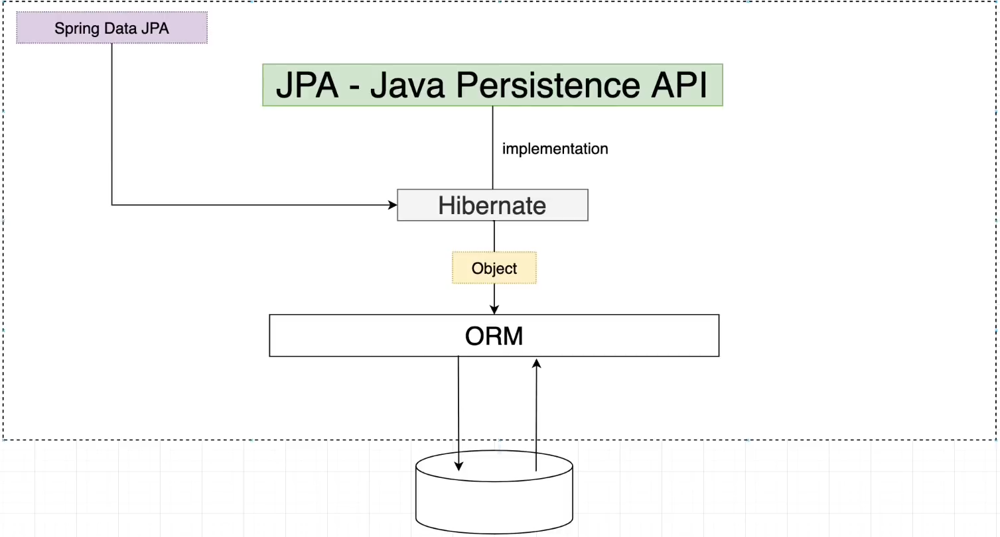
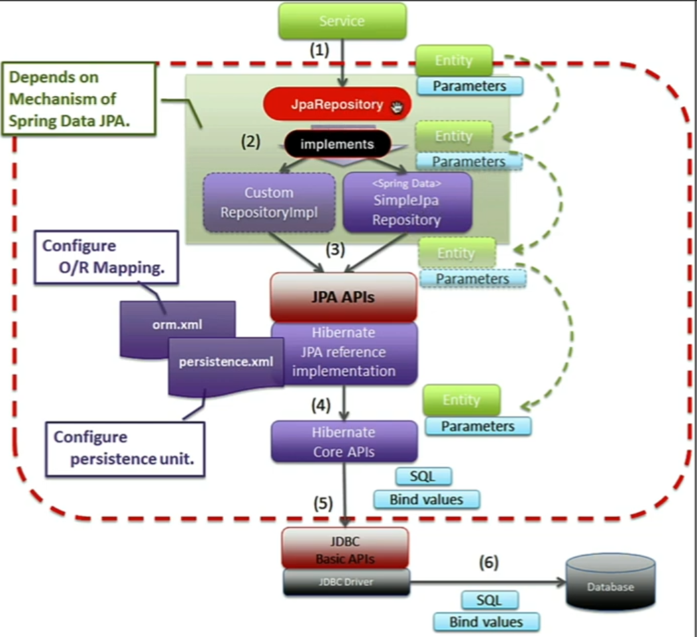

# Spring Data JPA

## What is Spring Data JPA

JPA(Java Persistence API)



### Basic Flow of Spring Data JPA




 Hibernate는 JPA Implementation

#### Hibernate vs Spring Data JPA

Spring Data JPA uses Hibernate as a default JPA provider

Spring Data JPA cannot work without a JPA provider


## Spring boot starter data jpa

```xml
<dependency>
    <groupId>org.springframework.boot</groupId>
    <artifactId>spring-boot-starter-data-jpa</artifactId>
</dependency>
```

jpa dependencies

Hivbernate dependencies

Spring Data JPA dependencies

AOP 등 많은 것들을 포함하고 있다.


## connect spring boot application with MySQL database

```xml
<dependency>
    <groupId>com.mysql</groupId>
    <artifactId>mysql-connector-j</artifactId>
    <scope>runtime</scope>
</dependency>
```

위의 dependencies를 통해 자동으로 연결

```properties
spring.datasource.url= jdbc:mysql://localhost:3306/ecommerce?useSSL=false
spring.datasource.username=root
spring.datasource.password=1234

spring.jpa.properties.hibernate.dialect=org.hibernate.dialect.MySQLDialect
# 위의 dialect는 설정을 해줘도 되고 안해도 된다. (체크하고 하거나 하지 말자!)

spring.jpa.hibernate.ddl-auto=update
# customize the Hibernate database schema generation process
# none create-only drop create-drop validate update

spring.jpa.show-sql=true
spring.jpa.properties.hibernate.format_sql=true
# 위의 두 줄은 포멧을 설정?
```

### ddl-auto

- none
  - hibernate가 database에 어떠한 작용도 하지 않음
- create-only
  - entity model을 생성함
- drop
  - drop the database schema using the entity model as a reference for the DDL DROP statements
- create
  - drop the database schema and recreate it afterward using the entity model as a reference
- create-drop
  - 지우고 새로 데이터베이스를 만든 다음, 종료하거나 하면 이후 다시 지운다

- validate
  - validate the underlying database schema against the entity mappings
- update
  - 변화 될 때 마다 모든 것을 db에 반영


