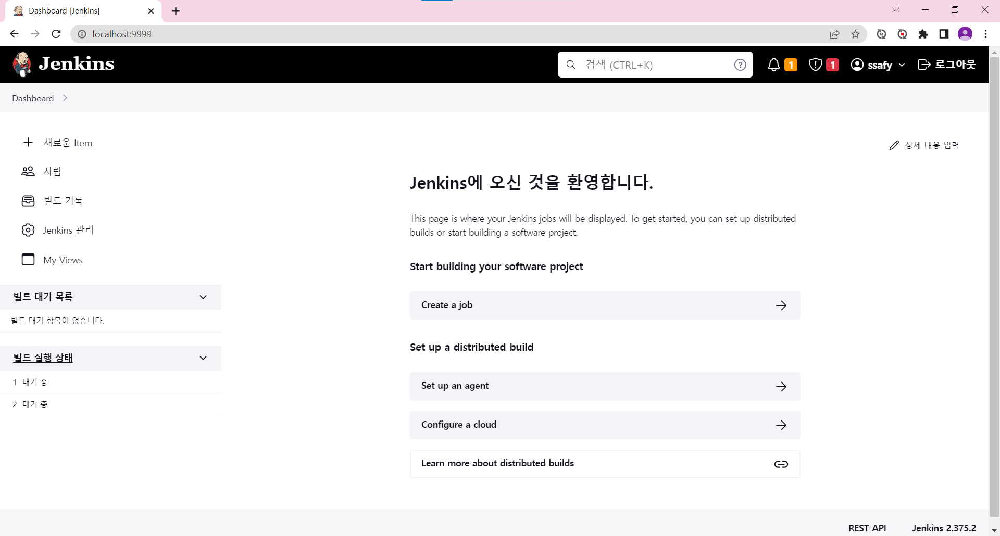

# Jenkins

> docker for windows에 기반하여 설명

지속적인 통합 및 배포를 위한 방법

빌드, 테스트 실행, 배포 등의 통합을 자동화

work flow를 제어하는 것이지, 소스를 가져오거나 Maven을 직접 실행하는 것이 아님


## Getting start

docker hub를 실행하여 jenkins를 pull 받는다.

```powershell
docker run -d --name jenkins -p 9999:8080 jenkins/jenkins:lts
```

`도커에서 jenkins/jenkins:lts 를 myjenkins라는 이름으로 실행하는데 9999포트로 들어온 것은 jenkins가 사용하고 있는 포트 8080과 연결해라`

```powershell
docker images
# 설치한 images 목록 확인
docker ps -a
# container 목록 확인
```

http://localhost:9999/ 로 접속하면 다음과 같은 화면이 뜬다.


```powershell
docker exec -it myjenkins /bin/bash
```

`myjenkins라는 컨테이너의 bash와 지속적으로 연결해라`

이후 jenkins에서 아래의 경로로 password를 찾을 수 있음

```power
cat /var/jenkins_home/secrets/initialAdminPassword
```

admin 까지 등록하면 다음과 같은 화면이 나온다.



## WebHook

jenkins와 webhook을 연동하기 위해서는 github에서 AccessToken이 필요함

