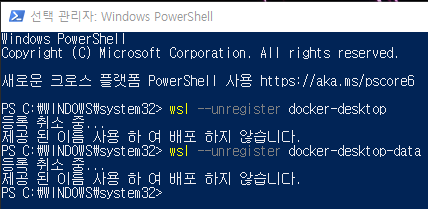

# Docker


## Docker vs VM

VM은 무거움 / os 때문에 많은 시간이 걸릴 수 있음

Docker는 os를 설치하지 않고 진행한다


## Getting start

docker for window를 설치

Microsoft Store에서 Ubuntu 설치

WSL을 2로 업데이트 후 설정

VMware 등을 사용하여 가상환경으로 Ubuntu를 설치하고, docker를 사용할 수 있음


Dockerfile을 만들고 Image를 만든다음 container에 등록하여 사용

```
docker run [OPTIONS] IMAGE[:TAG|@DIGEST] [COMMAND] [ARG...]
# 아래는 자주 사용하는 옵션
# -d : detached mode 백그라운드 모드
# -p : 호스트와 컨테이너의 포트를 연결
# -v : 호스트와 컨테이너의 디렉토리를 연결
# -name : 컨테이너 이름 설정
# -rm : 프로세스 종료시 컨테이너 자동 제거
# -it : 터미널 입력을 위한 옵션
# /bin/bash : 컨테이너 내부에 들어가기 위해 사용
```


## GitLab

도커에 gitlab 설치

```
docker pull gitlab/gitlab-ce
```

컨테이너 실행 (gitlab으로)

```
docker run --detach \
> --name gitlab \
> --hostname gitlab.example.com \
> --publish 4000:80 \
> --restart always \
> gitlab/gitlab-ce
```

gitlab 계정 비밀번호 초기화 (root계정)

```
gitlab-rails console -e production
# 이후 아래를 따라 입력
user = User.where(id:1).first
user.password = ''
user.password_confirmation = ''
user.save
exit
```


### 


## Errors

### docker for windows 실행시 getting start 계속 나올 때

아래 두 줄을 관리자 권한으로 실행한 powershell에 입력

```powershell
wsl --unregister docker-desktop
wsl --unregister docker-desktop-data
```



```powershell
dism.exe /online /enable-feature /featurename:Microsoft-Windows-Subsystem-Linux /all /norestart
dism.exe /online /enable-feature /featurename:VirtualMachinePlatform /all /norestart

wsl --set-default-version 2
```

### Got permission denied while trying to connect to the Docker

```
sudo usermod -a -G docker $USER
```

관리자 권한으로 powershell을 실행하여 위의 명령어를 입력


## Dockerfile

도커 이미지를 만들기 위해 Dickerfile에 DSL 언어를 사용해 이미지를 생성


```dockerfile
FROM {baseImage}
# 맨 처음에는 baseImage를 설정해야 함
WORKDIR {directory}
# 어떤 directory에 application을 복사해 올 것인지 작성
FROM <image>:<tag>
# 베이스 이미지를 지정 / tag는 버전을 의미
RUN <command>
# 명령어를 실행
```

변경이 잦은 layer는 낮은(밑에) 작성하면 된다.

dockerfile 작성에 대한 문서는 다음을 참고

http://docs.docker.com/develop/develop-images/dockerfile_best-practices/

## Docker build시 'none' 지워지지 않는 경우

```shell
# To remove all dangling Docker images:
sudo docker rmi $(sudo docker images -f “dangling=true” -q)

# If run as root omit "sudo"
docker rmi $(docker images -f “dangling=true” -q)
```


