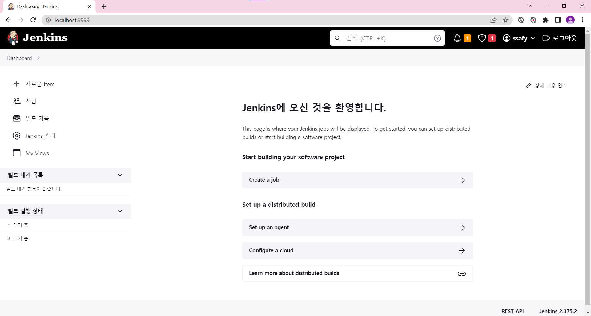
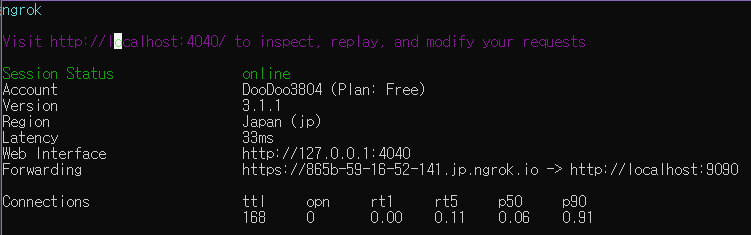

# Jenkins

> docker for windows에 기반하여 설명

지속적인 통합 및 배포를 위한 방법

빌드, 테스트 실행, 배포 등의 통합을 자동화

work flow를 제어하는 것이지, 소스를 가져오거나 Maven을 직접 실행하는 것이 아님


## Getting start

docker hub를 실행하여 jenkins를 pull 받는다.

```powershell
docker run -d --name jenkins -p 9999:8080 jenkins/jenkins:lts
```

`도커에서 jenkins/jenkins:lts 를 myjenkins라는 이름으로 실행하는데 9999포트로 들어온 것은 jenkins가 사용하고 있는 포트 8080과 연결해라`

```powershell
docker images
# 설치한 images 목록 확인
docker ps -a
# container 목록 확인
```

http://localhost:9999/ 로 접속하면 다음과 같은 화면이 뜬다.


```powershell
docker exec -it myjenkins /bin/bash
```

`myjenkins라는 컨테이너의 bash와 지속적으로 연결해라`

이후 jenkins에서 아래의 경로로 password를 찾을 수 있음

```power
cat /var/jenkins_home/secrets/initialAdminPassword
```

admin 까지 등록하면 다음과 같은 화면이 나온다.



이후 필요한 플러그인을 찾아서 설치하면 됨

------

## local 환경에서 CI/CD 구축

### :one: CI

### Jenkins 안에 Docker 설치하기

#### 1. 도커 설치

✔ 패키지들이 최신 버전인지 확인

```sql
sudo apt-get update && upgrade
```

✔ apt가 HTTPS를 통해 repository를 이용하는 것을 허용할 수 있도록 해주는 패키지들 설치

```sql
sudo apt-get install \
    ca-certificates \
    curl \
    gnupg \
    lsb-release
```

✔ docker 공식 GPG key 추가

```bash
curl -fsSL https://download.docker.com/linux/ubuntu/gpg | sudo gpg --dearmor -o /usr/share/keyrings/docker-archive-keyring.gpg
```

✔ docker repository를 등록

```bash
echo \
  "deb [arch=$(dpkg --print-architecture) signed-by=/usr/share/keyrings/docker-archive-keyring.gpg] https://download.docker.com/linux/ubuntu \
  $(lsb_release -cs) stable" | sudo tee /etc/apt/sources.list.d/docker.list > /dev/null
```

✔ docker 설치

```sql
sudo apt-get update
sudo apt-get install docker-ce docker-ce-cli containerd.io
```

#### 2. Jenkins 설치

✔ Jenkins 설치 및 컨테이너 구동

```javascript
docker run -u 0 -d -p 9090:8080 -p 50000:50000 -v /var/jenkins:/var/jenkins_home -v /var/run/docker.sock:/var/run/docker.sock --name jenkins jenkins/jenkins:lts
```

※ docker 설치 후 /var/run/docker.sock permission denied가 발생하는 경우

```bash
sudo chmod 666 /var/run/docker.sock
```

9090 포트 접속
docker logs jenkins 입력 후 비밀번호 입력
DashBoard > Manager Jenkins > Plugin Manager에서 gitlab, docker 검색 후 각각 상위 4개 항목 설치

#### 3. Jenkins 컨테이너 안 도커 설치

✔ Jenkins 컨테이너 접속

```bash
docker exec -it jenkins /bin/bash
```

✔ docker old version 제거

```csharp
apt-get remove docker docker-engine docker.io containerd runc
```

✔ 다음 명령어 차례로 입력

```sql
apt-get update
apt-get install \
    ca-certificates \
    curl \
    gnupg \
    lsb-release
mkdir -p /etc/apt/keyrings
curl -fsSL https://download.docker.com/linux/debian/gpg | gpg --dearmor -o /etc/apt/keyrings/docker.gpg
echo \
  "deb [arch=$(dpkg --print-architecture) signed-by=/etc/apt/keyrings/docker.gpg] https://download.docker.com/linux/debian \
  $(lsb_release -cs) stable" | tee /etc/apt/sources.list.d/docker.list > /dev/null
apt-get update
apt-get install docker-ce docker-ce-cli containerd.io docker-compose-plugin
```


### Jenkins 프로젝트 생성 및 CI/CD 구축

1. Jenkins 메인화면에서 '새로운 item' 클릭
2. 이름 작성 및 Freestyle project 선택 후 OK
3. 소스 코드 관리 > Git 선택
4. 빌드 유발 > Build when a change is pushed to Gitlab. 선택 & Secret token > Generate 선택 후 key 복사
5. Build Steps > Execute shell 선택
6. 프로젝트 루트 폴더로 이동 후 Dockerfile 실행하는 쉘 스크립트 작성

```bash
# 프로젝트 루트로 이동이 필요한 경우
cd ${PROJECT_ROOT}

docker build -t ${CONTAINER_NAME} .
docker run -d -p 포트번호:포트번호 ${CONTAINER_NAME} 
```

1. 빌드 후 조치 > Publish build status to GitLab 선택
2. 맨 아래 저장 버튼 클릭
3. GitLab에서 좌측 Settings > Webhooks
4. 4번에 있는 webhook URL을 URL에 입력하고 복사해 둔 Secret token을 입력
5. 프로젝트에 맞는 Trigger 설정 후 Add webhook 클릭
6. 하단 Project Hooks에서 원하는 Trigger를 유발하여 테스트 가능


### ngrok

- 로컬이라면 다음과 같은 ngrok를 설정해야함

1. ngrok [홈페이지](https://dashboard.ngrok.com/get-started/setup)에서 ngrok를 받음
2. 알집을 풀고 실행
3. 최초 한번만 계정과 연결을 함

```
ngrok authtoken [계정 생성후 발급받은 AuthToken]
```

4. 아래의 코드로 필요한 로컬포트의 도메인을 임시로 생성

```
ngrok http [원하는 서비스 포트]
```

> 아래는 예시



5. 임시 도메인 주소를 받았으면 저 주소로 Jenkins에 url 등록
6. item의 상세 정보를 들어가서 WebHook url을 복사해서 저장
7. GitLab의 경우 webhook에서 복사한 WebHook url을 사용하여 webhook을 만든다
8. 테스트 빌드를 실행하면 끝

## Dockerfile과 Jenkins build

### React

```dockerfile
# 가져올 이미지를 정의
FROM node:14
# 경로 설정하기
WORKDIR /app
# package.json 워킹 디렉토리에 복사 (.은 설정한 워킹 디렉토리를 뜻함)
COPY package.json .
# 명령어 실행 (의존성 설치)
RUN npm install
# 현재 디렉토리의 모든 파일을 도커 컨테이너의 워킹 디렉토리에 복사한다.
COPY . .

# 각각의 명령어들은 한줄 한줄씩 캐싱되어 실행된다.
# package.json의 내용은 자주 바뀌진 않을 거지만
# 소스 코드는 자주 바뀌는데
# npm install과 COPY . . 를 동시에 수행하면
# 소스 코드가 조금 달라질때도 항상 npm install을 수행해서 리소스가 낭비된다.

# 3000번 포트 노출
EXPOSE 3000

# npm start 스크립트 실행
CMD ["npm", "start"]

# 그리고 Dockerfile로 docker 이미지를 빌드해야한다.
# $ docker build .
```

package.json이 있는 디렉토리에서 다음의 Dockerfile을 작성한다.

```shell
cd frontend
# react 프로젝트가 있는 폴더로 이동
docker login -u doodoo3804 -p rlaehdbs11
# 도커에 로그인
docker build -t doodoo3804/react-frontend .
# Dockerfile을 doodoo3804/react-frontend의 이름으로  build 
docker push  doodoo3804/react-frontend
# docker에 이미지를 push

# 아래는 이미 실행되어있는 컨테이너의 이름이 있으면 중지하고 삭제 이후 재실행
# docker ps -q --filter "name=itda-server" && docker stop itda-server && docker rm itda-server
docker stop react-frontend && docker rm react-frontend
# 도커 이미지를 실행 3000 포트로 
docker run -d -p 3000:3000 --name react-frontend doodoo3804/react-frontend
```

### Spring Boot


### MySQL
