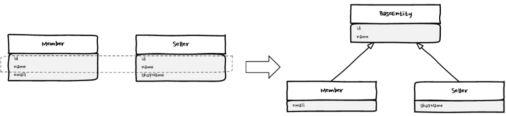
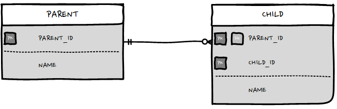
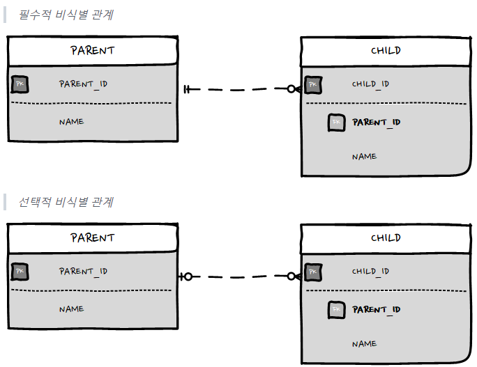

# 자바 ORM 표준 JPA 프로그래밍

- [04 엔티티 매핑](#04-엔티티-매핑)
- [05 연관 관계 매핑](#05-연관-관계-매핑)
- [06 다양한 연관관계 매핑](#06-다양한-연관관계-매핑)
- [07 고급 매핑](#07-고급-매핑)

------

## 04 엔티티 매핑

### @Entity

- 속성
  - name - 사용할 엔티티 이름
    - default - 클래스 이름

- 기본 생성자는 필수
- final  enum interface inner 클래스에는 사용 불가
- 저장할 필드에 final을 사용하면 안됨

### @Table

- 속성
  - name - 사용할 테이블 이름
    - default - 엔티티 이름을 사용
  - catalog - catalog 기능이 있는 DB에서 catalog를 매핑
  - schema - schema 기능이 있는 DB에서 schema를 매핑

### Schema 생성

```properties
spring.jpa.hibernate.ddl-auto = {속성 값}
```

- create - 기존 테이블을 삭제하고 새로 생성 (drop + create)
- create-drop - create + 종료시 생성한 테이블 drop
- update - DB 테이블과 엔티티 매핑 정보를 비교해서 변경 사항만 수정
- validate - 차이가 있으면 경고를 남기고 애플리케이션을 실행하지 않음 (DDL 변화 없음)

서버 운영 시에는 validate나 none으로 해야 운영되는 데이터가 날아가지 않는다

DB에는 언더_바로 이름을 생성

java는 camelCase로 이름을 생성

### @Column

- 속성
  - nullable - false 이면 not null
  - length - 길이 제한

### @Id

기본 키 매핑

### @GeneratedValue

식별자가 생성되는 경우에는 생성 전략을 선택해야 함

```java
@GeneratedValue(strategy = GenerationType.IDENTITY)
```

Sequence의 경우에는 조건에 따라 순차적으로 id를 생성 / 각각의 generator가 필요함

### 필드와 칼럼 매핑 : 레퍼런스

#### @Column

- 속성
  - name - 필드와 테이블의 Column이름을 매핑
  - nullable - null 허용 여부
  - unique - uniqueConstraints와 같음
  - length - String에서만 사용

#### @Enumerated

enum을 매핑할 때 사용

- 속성
  - value
    - EnumType.STRING - 이름을 DB에 저장
    - EnumType.ORDINAL - 순서를 DB에 저장

> enumeration type : 열거 타입
>
> 관레적으로 모두 알파벳으로 정의, 모두 대문자로 작성
>
> 단어 사이는 언더바(_)로 연결
>
> null도 값으로 대입 가능 

#### @Temporal

날짜 타입을 매핑할 때 사용

#### @Lob

DB의 BLOB CLOB과 매핑

#### @Transient

이 필드의 값을 매핑하지 않음 / DB에 저장하지도 조회하지도 않는다.

임시로 값을 저장할 때 사용

#### @Access

접근하는 방식을 지정

- 필드 접근 - AccessType.FIELD
- 프로퍼티 접근 - AccessType.PROPERTY
  - 접근자 Getter를 사용

### 데이터 중심 설계 vs 객체 지향 설계

데이터 중심 설계는 지양해야 함

특히 테이블에서 외래키를 그대로 가져오면 문제가 있다.

관계형 데이터베이스는 연관 된 객체를 가져올 때  외래 키를 사용해서 조인하면 되지만, 객체에는 조인 기능이 없어 객체를 찾을 때 참조를 사용해야 함

따라서 객체는 외래키 대신 참조를 사용해야 함

아래 처럼 외래키를 통한 재 조회를 하는 것이 아니라 참조를 한다.

```java
Order order = em.find(Order.class, orderId);
Member member = order.getMember();
```

## 05 연관 관계 매핑

객체의 참조와 테이블의 외래 키를 매핑

- 방향(direction)
  - 객체 관계에서만 존재하고, 테이블은 항상 양방향
  - 단방향 : 둘 중 한 쪽만 참조
  - 양방향 : 양쪽 모두 서로 참조

- 다중성(Multiplicity)
  - 다대일 / 일대다 / 일대일 / 다대다
- 연관 관계의 주인
  - 객체를 양방향 연관관계로 만들면 연관관계의 주인을 정해야 함

참조를 통한 연관관계는 언젠나 단방향

객체간에 연관관계를 양방향으로 만들고 싶으면 반대쪽에도 필드를 추가해서 참조를 보관해야함. 이는 양방향 관계가 아니라 서로 다른 단방향 관계 2개

### 객체 관계 매핑

#### @ManyToOne

연관관계를 매핑할 때 다중성을 나타내는 어노테이션을 필수로 사용해야 함

- 속성
  - optional
    - false로 설정하면 연관된 엔티티가 항상 있어야 함
      - default : true
  - fetch
    - 글로벌 fetch 전략 사용
  - cascade
    - 영속성 전이 기능
  - targetEntity
    - 연관된 엔티티의 타입 정보를 설정

#### @JoinColumn(name="TEAM_ID")

외래 키를 매핑할 때 사용

이 어노테이션은 생략 가능

- 속성
  - name
    - 매핑할 외래 키 이름
      - default : 필드명 + _ + 참조하는 테이블의 기본 키 칼럼명
  - referencedColumnName
    - 외래 키가 참조하는 대상 테이블의 칼럼명
      - 참조하는 테이블의 기본 키 칼럼명
  - ForeignKey
    - 외래 키 제약 조건

### 연관관계 사용

연관관계의 주인만이 데이터베이스 연관관계와 매핑되고 외래 키를 관리할 수 있다. 반면 주인이 아닌 다른 쪽은 읽기만 가능

주인이 아니면 `mappedBy`속성을 사용해야함

연관관계의 주인은 테이블에 외래 키가 있는 곳으로 정해야 함

만약 연관관계 주인을 주인이 아닌 곳에 입력을 하게 되면 아래와 같은 문제가 발생한다.

```sql
SELECT * FROM MEMBER;
```

| MEMBER_ID | USERNAME | TEAM_ID |
| --------- | -------- | ------- |
| member1   | 회원1    | null    |
| member2   | 회원2    | null    |


## 06 다양한 연관관계 매핑

### 다대일

#### 단방향

주인에 @JoinColumn만 있는 경우

#### 양방향

주인에 @JoinColumn을 작성하고 반대편에 mappedBy를 작성

양방향 연관관계는 항상 서로를 참조해야 함 / 연관관계 편의 메소드를 작성해 주는 것이 좋다. 편의 메소드는 한 곳에만 작성하거나 양쪽 다 작성할 수 있는데, 양쪽 다 작성하면 무한 루프에 빠질 수 있으므로 주의

@JoinColumn(name="member_id") : 어떤 이름의 칼럼으로 테이블에 설정할 것인지 명시 / 원래 referencedColumnName 속성을 생략하면 자동으로 해당 테이블의 pk값으로 지정

### 일대다

#### 단방향

일대다 단방향 매핑 보다는 다대일 양방향이 권장됨

#### 양방향

존재하지 않음 (하지마라)

### 일대일

일대일 관계는 그 반대도 일대일 관계다

주 테이블이나 대상 테이블 중 어느 곳이나 외래키를 가질 수 있다.

- 주 테이블에 외래 키
  주 객체가 대상 객체를 참조하는 것처럼 주 테이블에 외래 키를 두고 대상 테이블을 참조한다. 외래 키를 객체 참조와 비슷하게 사용할 수 있어 객체지향 개발자들이 선호하는 방식이다.
- 대상 테이블에 외래 키
  데이터베이스 개발자들은 보통 대상 테이블에 외래 키를 두는 것을 선호, 테이블 관계를 일대일 관계에서 일대다로 변경할 때 테이블 구조를 그대로 유지할 수 있음

일대일 매핑에서 대상 테이블에 외래 키를 두고 싶으면 양방향으로 매핑한다.(mappedBy="")

### 다대다

관계형 데이터데이스는 정규화된 테이블 2개로 다대다 관계를 표현할 수 없기 때문에, 중간에 연결 테이블을 추가해야 함

객체는 테이블과 다르게 객체 2개에서 컬렉션을 사용해 다대다 관계를 만들 수 있음(ManyToMany)

#### 단방향

```java
  @JoinTable(name = "member_product",
            joinColumns = @JoinColumn(name = "member_id"),
            inverseJoinColumns = @JoinColumn(name = "product_id"))
```

- name : 연결 테이블을 지정
- joinColumns : 현재 방향인 회원과 매핑할 조인 컬럼 정보를 지정
- inverseJoinColumns : 반대 방향인 상품과 매핑할 조인 컬럼 정보를 지정

#### 양방향

양방향 관계에서는 연관관계 편의 메서드를 사용하는 것이 편리

식별자(id)를 둘 이상 사용하려면 별도의 식별자 클래스가 필요

식별자가 2개 이상이면 식별자를 구분하기 위해 equals와 hashCode를 구현해서 동등성 비교 / @IdClass(관계형)와 @EmbededId(객체지향)

- @IdClass
  - 식별자 클래스의 속성명과 엔티티에서 사용하는 식별자의 속성명이 같아야 됨
  - Serializable 인터페이스를 구현해야 함
  - equals, hashCode를 구현해야 함
  - 기본 생성자가 있어야 함
  - 식별자 클래스는 public이어야 함
- @EmbededId
  - @Embeddedable 어노테이션을 붙어주어야 함
  - Serializable 인터페이스를 구현해야 함
  - equals, hashCode를 구현해야 함
  - 기본 생성자가 있어야 함
  - 식별자 클래스는 public이어야 함

#### 새로운 기본 키

데이터베이스에서 자동으로 생성해주는 대리 키를 Long 값으로 사용하는 것.  간편하고 반 영구적으로 쓸 수 있으며 비즈니스에 의존하지 않음, ORM매핑 시에 복합 키를 만들지 않아도 됨

## 07 고급 매핑

### 상속 관계 매핑

#### 조인 전략

엔티티 각각을 모두 테이블로 만들고 자식 테이블이 부모 테이블의 기본키를 받아서 기본 키 + 외래 키로 사용하는 전략
객체는 타입으로 구분할 수 있지만 테이블은 타입의 개념이 없으므로 타입을 구분하는 컬럼을 추가해야 함. 데이터 베이스 설계면에서는 가장 효율이 좋음

- @Inheritance(strategy = InheritanceType.JOINED)
  - 상속 매핑은 부모 클래스에 @Inheritance를 사용해야함. 매핑 전략을 조인 전략으로 지정함
- @DiscriminatorColumn(name="DTYPE")
  - 어떤 자식인지 구분하는 역할
  - 부모 엔티티는 자식 엔티티를 구분 할 수 있도록 타입을 구문하는 컬럼을 추가해야 함
  - 기본값이 DTYPE이므로 뒤에 name을 작성하지 않아도 됨
- @DIscriminatorValue("M")
  - 부모가 자식을 구문할 때 자신이 어떤 값을 갖는지 지정하는 역할을 함
  - 엔티티를 저장할 때 구분 칼럼에 입력할 값을 지정 / 위의 경우에는 M이 저장

#### 단일 테이블 전략

하나의 테이블만 사용

일반적으로 가장 빠르지만 자식 엔티티가 모두 null을 허용해야 함 / 구분 칼럼을 필수로 사용해야 함

- @DiscriminatorColumn(name="DTYPE")
  - 필수로 설정해야 함
  - DIscriminatorValue를 지정하지 않으면 기본으로 엔티티 이름을 사용(예: Movie, Album등)

#### 구현 클래스마다 테이블 전략

자식 엔티티마다 테이블을 만듦

이는 데이터베이스 설계자, ORM전문가 모두 추천하지 않음

### @MappedSuperclass

부모 클래스는 테이블과 매핑하지 않고 부모 클래스를 상속받는 자식 믈래스에게 매핑 정보만 제공하고 싶으면 @MappedSuperclass를 사용

@Entity와 비슷하지만 실제 테이블과 매핑되지 않는 차이점이 있다. 단순히 매핑 정보를 상속할 목적으로만 사용됨



연관 관계를 재정의 하려면 @AssociationOverride를 사용 / 만약 여러 개라면 @AssociationOverrides를 사용

```java
@Entity
@AttributeOverride(name = "id", column = @Column(name = "member_id"))
public class Member extends BaseEntity {...}

@Entity
@AttributeOverrides({
  @AttributeOverride(name = "id", column = @Column(name = "member_id"))
  @AttributeOverride(name = "name", column = @Column(name = "member_name"))
})
public class Member extends BaseEntity {...}
```

- 테이블과 매핑되지 않고 자식 클래스에 엔티티의 매핑 정보를 상속하기 위해 사용
- @MappedSuperclass로 지정한 클래스는 엔티티가 아니므로 영속성 관리 대상이 아님
- 이 클래스를 직접 생성해서 사용하지 않음 추상 클래스로 만드는 것을 권장

### 복합 키와 식별 관계 매핑

#### 식별 관계

부모 테이블의 기본 키를 내려받아서 자식 테이블의 기본 키 + 외래 키로 사용하는 관계



PARENT 테이블의 기본 키 PARENT_ID를 받아 CHILD 테이블의 기본 키 + 외래 키로 사용

#### 비식별 관계

부모 테이블의 기본 키를 받아서 자식 테이블의 외래 키로만 사용하는 관계



- 필수적 비식별 관계 : 외래 키에 NULL을 허용하지 않음. 연관관계를 필수적으로 맺어야 함
- 선택적 비식별 관계 : 외래 키에 NULL을 허용. 연관관계를 맺을지 말지 선택할 수 있음

##### 복합키 : 비식별 관계 매핑

JPA에서는 식별자를 둘 이상 사용하려면 별도의 식별자 클래스를 만들어어야 함

식별자가 하나면 상관 없지만, 2개 이상이면 별도의 식별자 클래스를만들고 equals와 hashCode를 구현해야 함([링크](#양방향))

- IdClass : 관계형 데이터베이스에 가까운 방법
- EmbededId : 객체지향에 가까운 방법

##### 복합키 : 식별 관계 매핑

식별 관계에서 자식 테이블은 부모 테이블의 기본 키를 포함해서 복합 키를 구성해야 하므로 @IdClass나 @EmbededId를 사용해서 식별자를 매핑해야 함

@EmbededId로 식별 관계를 구성할 때는 @MapsId를 사용해야 함

- @MapsId
  - 외래 키와 매핑한 연관관계를 기본 키에도 매핑하겠다는 뜻

##### 식별, 비식별 관계의 장단점

- 식별 관계는 부모 테이블의 기본 키를 자식 테이블로 전파하면서 자식 테이블의 기본 키 칼럼이 점점 늘어남, 조인할 때 SQL이 복잡해지고 기본 키 인덱스가 불필요하게 커질 수 있음
- 식별 관계는 2개 이상의 칼럼을 합해서 복합 기본 키를 만들어야 하는 경우가 많음
- 식별 관계를 사용할 때 기본 키로 비즈니스 의미가 있는 자연 키칼럼을 조합하는 경우가 많음, 반면 비식별이라면 대리 키를 주로 사용
- 식별관계는 부모 테이블의 기본 키를 자식 테이블의 기본 키로 사용하므로 비식별 관계 보다 테이블 국조가 유연하지 못함
- JPA에서 복합 키는 별도의 복합 키 클래스를 만들어서 사용해야 하므로 번거로움
- 비식별 관계의 기본 키는 주로 대리키를 사용하는데 JPA는 대리 키를 생성하기 위한 편리한 방법을 제공

위와 같은 이유들로 비 식별관계로 설계하는 것이 권장

### 조인 테이블

기본은 조인 칼럼을 사용하고 필요하다고 판단되면 조인 테이블을 사용

#### 일대일 조인 테이블


```java
public class Parent {

  @Id @GeneratedValue
  @Column(name = "parent_id")
  private Long id;
  private String name;

  @OneToOne
  @JoinTable(name = "parent_child",
  joinColumns = @JoinColumn(name = "parent_id"),
  inverseJoinColumns = @JoinColumn(name = "child_id"))
  private Child child;

}
```

@JoinTable

- name
  - 매핑할 조인 테이블 이름
- joinColumns
  - 현재 엔티티를 참조하는 외래 키
- inverseJoinColumns
  - 반대 방향 엔티티를 참조하는 외래 키

양방향으로 매핑하려면 아래의 코드를 추가하면 됨

```java
public class Child {
  ...
  @OneToOne(mappedBy="child")
  private Parent parent;
}
```

### 엔티티 하나에 여러 테이블 매핑

 @SecondaryTable을 사용하면 한 엔티티에 여러 테이블을 매핑할 수 있음

- @Secondary.name : 매핑할 다른 테이블의 이름
- @Secondary.pkJoinColumns : 매핑할 다른 테이블의 기본 키 칼럼 속성

이 방법은 항상 두 테이블을 조회하므로 최적화가 힘듦 
