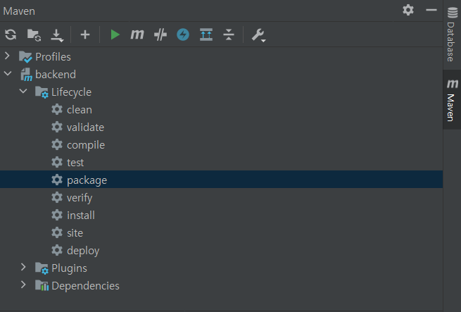
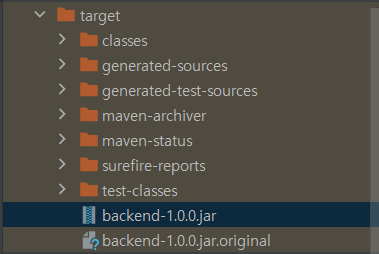
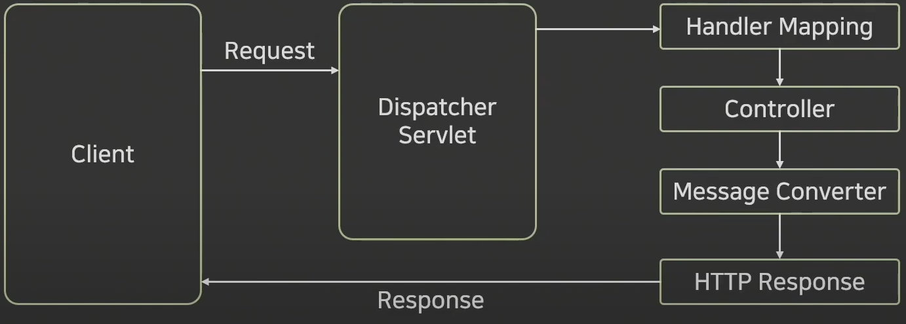
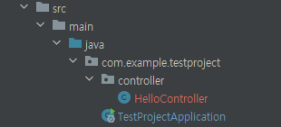
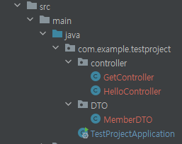
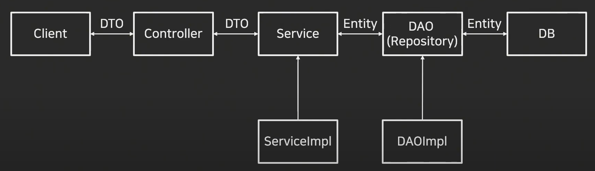

# Spring Tutorial

> based on IntelliJ

------

- [MQTT 통신](https://github.com/DooDoo3804/Study/blob/master/Language%26Framework/SpringBoot/MQTT%ED%86%B5%EC%8B%A0.md)
- [SpringBoot Fullcourse Summary](https://github.com/DooDoo3804/Study/blob/master/Language%26Framework/SpringBoot/SpringBoot_fullcourse.md)
- [ORM JPA 표준](https://github.com/DooDoo3804/Study/blob/master/Language%26Framework/SpringBoot/ORM_JPA.md)

------

## Maven과 Gradle

**빌드 관리 도구**

### Maven

프로젝트의 외부 라이브러리를 쉽게 참조할 수 있게 pom.xml 파일로 명시하여 관리

- XML 기반의 빌드 스크립트

- 라이프 사이클 도입

대표 태그들

- modelVersion
  - maven의 버전
- version
  - 프로젝트 버전
- dependencies
  - 의존성을 부여

### Gradle

멀티 프로젝트의 빌드에 최적화하여 설계

Maven 보다 빠른 처리 속도를 가지고 있음

Maven이 더 높은 점유율을 가지고 있음

대규모 프로젝트에서 성능이 좋음


## Build 및 배포

우측 nav바에서 maven을 확장



왼쪽 backend의 lifecycle에서 package를 선택하고 실행을 하면 빌드를 시작함



좌측의 navbar에서 target 폴더에 {프록젝트 이름}{버전}.jar 파일이 생성된다.

```shell
java -jar {파일이름}.jar
```

위의 코드를 실행하면 배포한 프로젝트를 실행할  수 있다.


## Test 코드 실행

클래스 명에서 Alt+Enter를 입력하여 Test 코드를 추가할 수 있음


참고

| assertEquals(a, b); | 객체 A와 B의 실제 값이 일치한지 확인한다.                    |
| ------------------- | ------------------------------------------------------------ |
| assertSame(a, b);   | 객체 A와 B가 같은 객체임을 확인한다. - assertEquals 메서드는 두 객체의 값의 비교 - assertSame 메서드는 두 객체가 동일한지 객체의 비교 (== 연산자와 같다) |
| assertTrue(a);      | 조건 A가 참인가를 확인한다.                                  |
| assertNotNull(a);   | 객체 A가 null이 아님을 확인한다.                             |

## Swagger

서버로 요청되는 API 리스트를 html 화면으로 문서화 하여 테스트 가능

REST API의 스펙을 문서화 하는 것이 중요함

### 설정방법

@Configuration : 어노테이션 기반의 환경 구성을 돕는 어노테이션

@Bean : 외부 라이브러리 등 ...?

- pom.xml - 아래와 같은 dependency 추가

```xml
		<dependency>
			<groupId>io.springfox</groupId>
			<artifactId>springfox-swagger2</artifactId>
			<version>3.0.0</version>
		</dependency>
		<dependency>
			<groupId>io.springfox</groupId>
			<artifactId>springfox-boot-starter</artifactId>
			<version>3.0.0</version>
		</dependency>
		<dependency>
			<groupId>io.springfox</groupId>
			<artifactId>springfox-swagger-ui</artifactId>
			<version>3.0.0</version>
		</dependency>
```

```java
package com.example.testproject.config;

import org.springframework.context.annotation.Bean;
import org.springframework.context.annotation.Configuration;
import springfox.documentation.builders.ApiInfoBuilder;
import springfox.documentation.builders.PathSelectors;
import springfox.documentation.builders.RequestHandlerSelectors;
import springfox.documentation.service.ApiInfo;
import springfox.documentation.spi.DocumentationType;
import springfox.documentation.spring.web.plugins.Docket;
import springfox.documentation.swagger2.annotations.EnableSwagger2;

@Configuration
@EnableSwagger2
public class SwaggerConfiguration {

    @Bean
    public Docket api() {
        return new Docket(DocumentationType.SWAGGER_2)
                .apiInfo(apiInfo())
                .select()
                .apis(RequestHandlerSelectors.basePackage("com.example.testproject"))
                .paths(PathSelectors.any())
                .build();
    }

    private ApiInfo apiInfo() {
        return new ApiInfoBuilder()
                .title("Open Api Test With Swagger")
                .description("설명")
                .version("1.0")
                .build();
    }
}
```

config 패키지를 생성하여 위와 같이 작성하면 Sweager를 들어갈 수 있음

### 오류 해결

`Failed to start bean 'documentationPluginsBootstrapper';`

위와 같은 오류는 spring과 swagger 사이의 버전이 호환되지 않아서 발생

- spring 을 2.4.2로 낮춤

  - 실행해 보니 3.0.0도 정상 작동

  > 아래의 코드만 추가하면 되는 것 같다

- properties에 다음과 같은 코드 추가

  - `spring.mvc.pathmatch.matching-strategy = ANT_PATH_MATCHER`

```java
```


## Lombok

반복되는 메소드를 Annotation을 사용하여 자동으로 작성해주는 라이브러리


Getter Setter NoArgConstructor Data ToString 등

```java
<dependency>
    <groupId>org.projectlombok</groupId>
    <artifactId>lombok</artifactId>
    <optional>true</optional>
</dependency>
```

### Getter Setter

@Getter / @Setter 를 추가하면 `Alt+INS`를 통해 입력하지 않아도 생성된다.

### @NoArgsConstructor

 파라미터가 없는 생성자를 생성

### @AllArgsConstructor

모든 필드 값을 파라미터로 갖는 생성자를 생성

### @RequiredArgsConstructor

필드값 중 final이나 @NotNull인 값을 갖는 생성자를 생성

### @ToString

toString 메소드를 자동으로 생성

(exclude='')를 통해 생성하지 않았으면 하는 부분을 제외하고 생성할 수 있음

### @EqulaAndHashCode

equals : 두 객체의 내용이 같은지 동등성을 비교하는 연산자

hashcode : 두 객체가 같은 객체인지 동일성을 비교하는 연산자

### @data

앞의 모든 어노테이션 모두를 추가함 (모두 추가하기 때문에 골라서 하지 못함)


```java
import lombok.Getter;
import lombok.Setter;
import lombok.ToString;

@Getter
@Setter
@ToString
public class MemberDTO {
    
    private String name;
    private String email;
    private String organization;

}
// Getter Setter ToString 을 저 6줄로 채울 수 있다!!
```


## Starting

spring initializr를 체크하여 생성

Maven / Gradle 빌드 베포 툴


### 파일 구조

#### pom.xml

packaging - 패키징 타입 설정 (jar / war)

```xml
<parent>
    <groupId>org.springframework.boot</groupId>
    <artifactId>spring-boot-starter-parent</artifactId>
    <version>3.0.0</version>
    <relativePath/> <!-- lookup parent from repository -->
</parent>
```

parent에 잡힌 dependency 같은 것들을 상속을 받아 사용할 수 있게 함 -> 코드 중복을 피할 수 있음

- dependencies
  - scope
    - compile(default) - 모든 클래스 경로에서 사용 가능
    - provided - JDK 또는 Container가 런타임 시에만 제공 / 베포 때는 빠짐
    - runtime - 실행 상황에서만 작용
    - test - 테스트 사용에서만 사용

```xml
<dependencies>
    <dependency>
        <groupId>org.springframework.boot</groupId>
        <artifactId>spring-boot-starter-web</artifactId>
    </dependency>

    <dependency>
        <groupId>org.springframework.boot</groupId>
        <artifactId>spring-boot-configuration-processor</artifactId>
        <optional>true</optional>
    </dependency>
    <dependency>
        <groupId>org.projectlombok</groupId>
        <artifactId>lombok</artifactId>
        <optional>true</optional>
    </dependency>
    <dependency>
        <groupId>org.springframework.boot</groupId>
        <artifactId>spring-boot-starter-test</artifactId>
        <scope>test</scope>
    </dependency>
</dependencies>
```

추가한 open API들을 기재하는 부분

- build

```xml
<build>
    <plugins>
        <plugin>
            <groupId>org.springframework.boot</groupId>
            <artifactId>spring-boot-maven-plugin</artifactId>
            <configuration>
                <excludes>
                    <exclude>
                        <groupId>org.projectlombok</groupId>
                        <artifactId>lombok</artifactId>
                    </exclude>
                </excludes>
            </configuration>
        </plugin>
    </plugins>
</build>
```

build안에는 plug-in들이 기재됨


## MVC 패턴

model view controller

서로의 의존성을 낮춤

### Controller

model 과 view 사이에서 브릿지 역할을 수행

사용자의 요청은 모두 컨트롤러를 통해 진행됨

### Model

데이터 처리하는 영역

DAO(Data Access Object) DO(Data Object)로 구성

### View

데이터를 보여주는 화면 자체의 영역

데이터를 보관하지 않고 처리만 하여 보여주기만 함


## RESTController

@Controller에 @가 결함된 어노테이션

view를 거치지 않고 ResponseBody에 직접 return 값을 전달 (문자열과 JSON)




### Basic

```java
package com.example.testproject.controller;

import org.springframework.web.bind.annotation.GetMapping;
import org.springframework.web.bind.annotation.RestController;

// import org.springframework.web.bind.annotation.RequestMapping;
// import org.springframework.web.bind.annotation.RequestMethod;

@RestController
public class HelloController {
//    @RequestMapping(value = "/hello", method = RequestMethod.GET)
    @GetMapping("hello")
    // hello는 주소
    public String hello() {
        return "Hello World";
    }
}
```

@RequestMapping을 통해 적는 방법은 구식이다. GET방식을 통한 요청만 받기 위해 import 할것이 많다.

@GetMapping을 통하면 한 번에 요청에 대해 처리할 수 있다.



위의 파일 경로 이미지에서 TestProjectApplication을 실행하여 프로그램을 실행할 수 있음.

주소는 `http://localhost:8080/hello`이다.


### GET API

#### @RequestMapping

고전 방법으로 이제 사용하지 않음

파라미터가 필요함

#### @GETMapping

별도의 파라미터가 필요하지 않음

```java
@GetMapping("/hello")
public String hello() {
    return "Hello World";
}
```

#### @PathVariable

GET 요청에서 파라미터를 전달하기 위해 URL에 변수 값을 담아 요청하는 방법

```java
@GetMapping(value="/hello/{variable}")
public String variable1(@PathVariable String variable) {
    return variable;
}

// 주소에 필요한 변수이름과 메서드에서 선언하는 변수이름이 다른 경우는 아래와 같이 작성
// variable과 var가 다른 경우
@GetMapping(value="/hello/{variable}")
public String variable1(@PathVariable("variable") String var) {
    return var;
}
```

#### @RequestParam

쿼리 문자열을 전달하기 위한 방법

key = value 의 형태로 값을 받음

따라서 어떤 params가 들어올지 모르는 경우 Map으로 선언하여 준다.

```java
@GetMapping(value="/request1")
public String getRequestParams(
	@RequestParam String name,
	@RequestParam String email,
	@RequestParam String organization) {
    return name + "" + email + "" + organization;
}

// 아래는 동일한 코드지만 param이 뭐가 들어오는지 모르는 경우 하는 설정
@GetMapping(value = "/request2")
public String getRequestParam2(@RequestParam Map<String, String> param) {
    StringBuilder sb = new StringBuilder();

    param.entrySet().forEach(map -> {
        sb.append(map.getKey() + " : " + map.getValue() + "\n");
    });
    return sb.toString();
}
```

##### StringBuilder

String 끼리 합치는 경우 많은 문자열을 더하게 되면 메모리가 낭비된다.

append를 통해 합치면 됨

출력 시에는 toString을 통해 출력 / String 변수에 넣을 때도 toString을 사용

```java
StringBuilder sb = new StringBuilder();
sb.append(String a);
return sb.toString();
```


#### DTO 활용



DTO 패키지를 위의 경로처럼 생성한다.

- MemberDTO

Getter와 Setter를 아래와 같이 작성하고 toString 까지 작성한다.

**`alt + inset`를 누르면 Getter와 Setter 및 toString을 매우 빠르게 빌딩이 가능하다.**

```java
package com.example.testproject.DTO;

public class MemberDTO {
    private String name;
    private String email;
    private String organization;

    public String getName() {
        return name;
    }

    public void setName(String name) {
        this.name = name;
    }

    public String getEmail() {
        return email;
    }

    public void setEmail(String email) {
        this.email = email;
    }

    public String getOrganization() {
        return organization;
    }

    public void setOrganization(String organization) {
        this.organization = organization;
    }

    @Override
    public String toString() {
        return "MemberDTO{" +
                "name='" + name + '\'' +
                ", email='" + email + '\'' +
                ", organization='" + organization + '\'' +
                '}';
    }
}
```

- GetComtroller.java

아래와 같이 선언하여 사용하면 된다.

```java
import com.example.testproject.DTO.MemberDTO;
// DTO 위치를 추가하여 클래스를 추가해준다.
@GetMapping(value = "/request3")
public String getRequestParam3(MemberDTO memberDTO) {
    return memberDTO.toString();
}
```


### POST API

#### PostMapping

```java
@RequestMapping("/api/v1/post-api")
// 최상단의 주소로 해당 클래스는 다음의 주소로 시작한다

@PostMapping(value = "/default")
public String postMethod() {
    return "Hello World!";
}
```

만약 데이터가 body에 있다면 @RequestBody를 통해 body의 값을 받아야함

body의 데이터는 JSON의 형태로 전달됨

```java
@PostMapping(value = "/member")
public String postMember(@RequestBody Map<String, Object> postData) {
    StringBuilder sb = new StringBuilder();
    postData.entrySet().forEach(map -> {
        sb.append(map.getKey() + " " + map.getValue() + "\n");
    });
    return sb.toString();
}
```

#### DTO사용

위의  GetAPI와 거의 동일하지만 Post 방식이므로 @RequestBody가 필요함 (MemberDTO는 동일한 클래스 사용)

```java
@PostMapping(value = "/member2")
public String postMemberDTO(MemberDTO memberDTO) {
    return memberDTO.toString();
}
```


### PUT API

해당 리소스가 존재하면 갱신, 없는 경우면 생성

```java
@RestController
@RequestMapping("/api/v1/put-api")
public class PutController {

    @PutMapping(value = "/default")
    public String putMethod() { return "Hello World!"; }

    @PutMapping(value = "/member")
    public String postMember(@RequestBody Map<String, Object> postData) {
        StringBuilder sb = new StringBuilder();
        postData.entrySet().forEach(map -> {
            sb.append(map.getKey() + " " + map.getValue() + "\n");
        });
        return sb.toString();
    }

   @PutMapping(value = "/member1")
    public String postMemberDto1(@RequestBody MemberDTO memberDTO) {
        return memberDTO.toString();
   }
   
   @PutMapping(value = "/member2")
    public MemberDTO postMemberDto2(@RequestBody MemberDTO memberDTO) {
        return memberDTO;
   }
   
   @PutMapping(value = "/member3")
    public ResponseEntity<MemberDTO> postMemberDto3(@RequestBody MemberDTO memberDTO) {
        return ResponseEntity.status(HttpStatus.ACCEPTED).body(memberDTO);
   }
```

/member1의 경우는 toString을 통해 작성된 형태로 출력이 됨

반면 /member2의 경우는 memberDTO의 object를 JSON의 형태로 출력이 됨

/member3은 httpstatus를 추가함 / .body값에 memberDTO를 추가한 모습


### Delete API

일반적으로 @PathVariable을 통해 리소스 ID를 받음

```java
@RestController
@RequestMapping("/api/v1/get-api/")
public class DeleteController {
    @DeleteMapping(value = "/delete/{variable}")
    public String DeleteVariable(@PathVariable String variable) {
        return variable;
    }
}
```


### ResponseEntity

HttpEntity라는 클래스를 상속받아 사용하는 클래스

Http response를 표현하기 위함


## DB적용

### Spring Boot 서비스 구조



### Entity

데이터베이스에 쓰일 컬럼과 여러 엔티티 간의 연관관계를 정의

### Repository

Entity에 의해 생성된 데이터베이스에 접근하는 메서드를 사용하기 위한 인터페이스

데이터 베이스에 적용할 CRUD를 정의 

#### repository 설정

Query 메소드에 **포함할 수 있는 키워드**는 다음과 같다.

| **메서드 이름 키워드** | **샘플**                                           | **설명**                           |
| ---------------------- | -------------------------------------------------- | ---------------------------------- |
| And                    | findByEmailAndUserId(String email, String userId)  | 여러필드를 and 로 검색             |
| Or                     | findByEmailOrUserId(String email, String userId)   | 여러필드를 or 로 검색              |
| Between                | findByCreatedAtBetween(Date fromDate, Date toDate) | 필드의 두 값 사이에 있는 항목 검색 |
| LessThan               | findByAgeGraterThanEqual(int age)                  | 작은 항목 검색                     |
| GreaterThanEqual       | findByAgeGraterThanEqual(int age)                  | 크거나 같은 항목 검색              |
| Like                   | findByNameLike(String name)                        | like 검색                          |
| IsNull                 | findByJobIsNull()                                  | null 인 항목 검색                  |
| In                     | findByJob(String … jobs)                           | 여러 값중에 하나인 항목 검색       |
| OrderBy                | findByEmailOrderByNameAsc(String email)            | 검색 결과를 정렬하여 전달          |


### DAO

데이터베이스에 접근하는 객체를 의미

Service와 DB를 연결해줌

데이터를 조회하거나 조작하는 기능을 전담

### DTO (VO)

계층간 데이터 교환을 위한 객체를 의미

